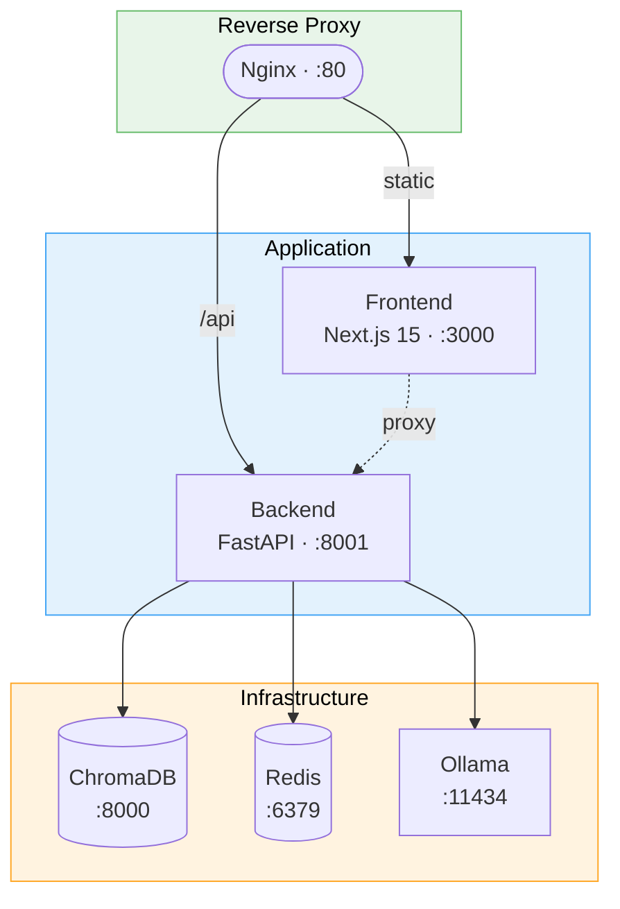

# onTong

**Knowledge-Fused Multi-Agent Platform for SCM** — 위키 지식관리 + 코드-도메인 매핑 + 비즈니스 시뮬레이션을 통합한 제조 SCM 플랫폼

  


## 이런 문제를 해결합니다


| 기존 문제                       | onTong 해결 방식                         |
| --------------------------- | ------------------------------------ |
| 사내 문서가 여기저기 흩어져 있어 찾기 어렵다   | 하이브리드 검색 (BM25 + 벡터) + 관계 그래프로 즉시 탐색 |
| 같은 내용의 문서가 여러 버전 존재한다       | 자동 충돌 감지 + 문서 계보(Lineage) 추적         |
| 신입/담당자가 바뀔 때마다 인수인계가 안 된다   | AI Copilot이 문서 기반으로 절차를 즉시 안내        |
| 문서를 써도 아무도 안 본다             | 스킬 시스템으로 AI가 자동으로 관련 문서를 활용          |
| 보안/폐쇄망 환경에서 클라우드 도구를 쓸 수 없다 | 로컬 LLM(Ollama) 지원, 외부 의존성 제로         |


  


## 플랫폼 구조

onTong은 3개 섹션으로 구성되어 있으며, 하나의 애플리케이션에서 함께 동작합니다.


| 섹션                         | 용도                  | 대상 사용자 | 상태   |
| -------------------------- | ------------------- | ------ | ---- |
| **Section 1 (Wiki)**       | 문서 관리 + AI Q&A      | 전체     | 운영 중 |
| **Section 2 (Modeling)**   | 코드매핑 / 온톨로지 / 영향분석  | IT 담당자 | 개발 중 |
| **Section 3 (Simulation)** | 시뮬레이션 시나리오 설계 / 시각화 | SCM 현업 | 개발 중 |


### 섹션별 개발 가이드


| 섹션                     | 작업 영역                                                         | 가이드                                                        |
| ---------------------- | ------------------------------------------------------------- | ---------------------------------------------------------- |
| Section 3 (Simulation) | `backend/simulation/` · `frontend/src/components/simulation/` | **[Section 3 개발 가이드 →](docs/section3-developer-guide.md)** |
| Section 2 (Modeling)   | `backend/modeling/`                                           | (팀 리더 담당)                                                  |
| Section 1 (Wiki)       | `backend/application/` · `frontend/src/components/`           | 아래 기능 목록 참고                                                |


> 아키텍처 상세: [platform_architecture_v2.md](toClaude/reports/platform_architecture_v2.md)

  


## 주요 기능 (Section 1 — Wiki)

### 위키 에디터

- **Tiptap WYSIWYG 에디터** — 마크다운 소스 모드 전환, 슬래시(`/`) 명령어, 테이블, 체크리스트
- **YAML Frontmatter 메타데이터** — 도메인, 프로세스, 태그, 문서 상태(draft/approved/deprecated)
- **WikiLink** — `[[문서명]]` 입력 시 자동 링크 변환, 클릭으로 문서 이동
- **클립보드 붙여넣기** — Excel 표 → 테이블 변환, 스크린샷 → 이미지 자동 업로드
- **편집 잠금** — 동시 편집 방지 (Redis 기반 분산 락)

### 멀티포맷 뷰어

- **Excel** (.xlsx) — 읽기 + 편집 + 저장
- **PDF** — 페이지 네비게이션, 줌, 대용량 페이지네이션
- **PowerPoint** (.pptx) — 슬라이드 뷰어 (Bold/Italic/Color/Image)
- **이미지** — 줌, 패닝

### AI Copilot (v3 고도화) — **[에이전트 아키텍처 상세 →](docs/agent-architecture.md)**

- **RAG 기반 Q&A** — 하이브리드 검색(BM25 + 벡터) 후 근거와 함께 답변
- **ReAct 자율 검색** — 검색 결과가 부족하면 LLM이 쿼리를 자동 재구성하여 재검색 (최대 3턴)
- **에이전트 인격 시스템** — `ontong.md`로 응답 톤/규칙/제약조건 정의, 코드 변경 없이 프롬프트 튜닝
- **토큰 기반 히스토리** — 고정 턴 수 대신 4,000 토큰 예산으로 대화 맥락 관리, 초과 시 구조화된 요약 자동 생성
- **주제 전환 감지** — 대화 중 주제가 바뀌면 이전 맥락을 자동 분리하여 컨텍스트 오염 방지
- **스킬별 도구 풀 제한** — intent(질문/작성/편집)에 따라 사용 가능한 스킬을 자동 제한
- **스킬 권한 매핑** — READ/WRITE/EXECUTE 레벨로 스킬 실행 권한 관리, 역할 기반 차단
- **세션 영속성** — JSONL 파일 기반 대화 기록 저장, 서버 재시작 후 대화 복원
- **SSE 스트리밍** — 토큰 단위 실시간 응답 + 사고 과정 단계별 표시
- **출처 표시** — 참조 문서 링크, 작성자, 날짜, 신뢰도 배지
- **승인 워크플로우** — AI가 문서 수정 제안 시 diff 미리보기 + 승인/거절
- **LLM 기반 의도 분류** — 구조화된 출력(Pydantic AI)으로 질문/작성/편집 의도를 정밀 분류

### 스킬 시스템

- **6-Layer 구조** — 역할 → 워크플로우 → 지시사항 → 체크리스트 → 출력형식 → 제한사항
- **자동 매칭** — 사용자 질문에서 트리거 키워드 감지 → 스킬 자동 제안
- **참조 문서 연결** — 스킬이 `[[WikiLink]]`로 참조하는 문서를 자동 로딩
- **카테고리/우선순위** — 폴더 기반 분류, 우클릭 메뉴, 드래그앤드롭 이동
- **CRUD** — 사이드바에서 생성/편집/복제/토글/삭제

### 검색 및 탐색

- **하이브리드 검색** — BM25 키워드 + 벡터 의미 검색 + RRF 병합
- **Cross-encoder 리랭킹** — LLM 기반 검색 결과 정밀 재정렬
- **Ctrl+K 커맨드 팔레트** — 서버 사이드 검색, 태그 뱃지, 스니펫 미리보기
- **문서 관계 그래프** — 노드 클릭 탐색, 호버 툴팁, 엣지 타입별 시각화

### 문서 품질 관리

- **충돌 감지 대시보드** — 유사 문서 쌍 자동 발견, 코사인 유사도 기반
- **Side-by-side Diff** — 두 문서 비교, 변경 하이라이트
- **문서 계보(Lineage)** — `supersedes` / `superseded_by`로 버전 체인 추적
- **RAG 자동 필터** — deprecated 문서 검색 제외 + 최신 문서 자동 대체
- **Auto-Tag** — LLM이 문서 내용 분석 후 메타데이터 태그 자동 추천

### 엔터프라이즈 대응

- **RBAC** — 역할 기반 접근 제어, 폴더/문서 단위 ACL
- **에어갭 지원** — 외부 CDN/폰트/API 의존성 제로, Ollama 로컬 LLM
- **Docker 컨테이너화** — 멀티스테이지 빌드, 헬스체크, 리소스 제한
- **수평 확장** — Nginx 로드밸런서, Uvicorn 멀티워커, Redis 상태 공유
- **비동기 인덱싱** — 저장 즉시 반환, 백그라운드 벡터 인덱싱
- **실시간 이벤트** — SSE 기반 트리/잠금/인덱싱 상태 브로드캐스트

  


## 아키텍처




### 기술 스택

각 기술의 선택 이유와 구체적인 사용 방식은 **[기술 스택 상세 →](docs/tech-stack.md)** 에서 확인하세요.


| 계층        | 기술                                                                     |
| --------- | ---------------------------------------------------------------------- |
| **프론트엔드** | Next.js 15, React 19, Tiptap, shadcn/ui, Zustand, react-force-graph-2d |
| **백엔드**   | FastAPI, Pydantic v2, Pydantic AI, aiofiles                            |
| **벡터 DB** | ChromaDB (all-MiniLM-L6-v2 임베딩)                                        |
| **검색**    | BM25 (rank-bm25) + 벡터 + RRF 병합 + Cross-encoder 리랭킹                     |
| **LLM**   | Ollama / OpenAI / Anthropic / Google Gemini / Azure / Groq / DeepSeek  |
| **캐시/락**  | Redis 7 (분산 락, 쿼리 캐시, 충돌 스토어)                                          |
| **프록시**   | Nginx (로드밸런싱, SSE 지원, gzip)                                            |
| **컨테이너**  | Docker Compose, 멀티스테이지 빌드                                              |


  


## 빠른 시작

### 사전 요구사항


| 구분                      | 버전    | 필수 여부       |
| ----------------------- | ----- | ----------- |
| Docker & Docker Compose | 20+   | 필수          |
| Node.js                 | 20+   | 개발 모드 시     |
| Python                  | 3.10+ | 개발 모드 시     |
| Ollama                  | 최신    | LLM 기능 사용 시 |


### 방법 1: Docker로 전체 실행 (권장)

```bash
# 1. 저장소 클론
git clone https://github.com/Jeensh/onTong.git
cd onTong

# 2. 환경 변수 설정
cp .env.production.example .env

# 3. 전체 서비스 실행
docker compose up -d

# 4. 상태 확인
docker compose ps
curl http://localhost/health
```

[http://localhost](http://localhost) 에서 접속합니다.

### 방법 2: 개발 모드 (소스 직접 실행)

**터미널 1 — 인프라 서비스:**

```bash
docker compose up -d chroma redis
```

**터미널 2 — 백엔드:**

```bash
# 가상환경 생성 및 의존성 설치
python -m venv venv
source venv/bin/activate
pip install poetry && poetry install

# 환경 변수
cp .env.example .env

# 서버 실행
uvicorn backend.main:app --port 8001 --reload
```

**터미널 3 — 프론트엔드:**

```bash
cd frontend
npm install
npm run dev
```

[http://localhost:3000](http://localhost:3000) 에서 접속합니다.

### LLM 설정 (선택)

AI Copilot 기능을 사용하려면 LLM이 필요합니다. `LITELLM_MODEL` 환경 변수를 `{provider}/{model}` 형식으로 설정하면 자동으로 해당 프로바이더에 연결됩니다.

**Ollama (로컬, 기본값):**

```bash
# Ollama 설치 후
ollama pull llama3
```

```env
LITELLM_MODEL=ollama/llama3
OLLAMA_HOST=http://localhost:11434
```

**OpenAI:**

```env
LITELLM_MODEL=openai/gpt-4o
LITELLM_API_KEY=sk-your-api-key
```

**Anthropic:**

```env
LITELLM_MODEL=anthropic/claude-sonnet-4-20250514
ANTHROPIC_API_KEY=sk-ant-your-key
```

**Google Gemini:**

```env
LITELLM_MODEL=google/gemini-2.0-flash
GOOGLE_API_KEY=your-key
```

**그 외 지원 프로바이더:** Azure OpenAI (`azure/gpt-4o`), Groq (`groq/llama3-70b-8192`), DeepSeek (`deepseek/deepseek-chat`)

> LLM 없이도 위키 편집, 검색, 파일 뷰어 등 핵심 기능은 모두 사용할 수 있습니다.

  


## 환경 변수


| 변수                   | 기본값                      | 설명                                                 |
| -------------------- | ------------------------ | -------------------------------------------------- |
| `LITELLM_MODEL`      | `ollama/llama3`          | LLM 모델 (`{provider}/{model}` 형식)                   |
| `OLLAMA_HOST`        | `http://localhost:11434` | Ollama 서버 주소                                       |
| `LITELLM_API_KEY`    | (없음)                     | OpenAI API 키                                       |
| `ANTHROPIC_API_KEY`  | (없음)                     | Anthropic API 키                                    |
| `GOOGLE_API_KEY`     | (없음)                     | Google Gemini API 키                                |
| `GROQ_API_KEY`       | (없음)                     | Groq API 키                                         |
| `DEEPSEEK_API_KEY`   | (없음)                     | DeepSeek API 키                                     |
| `AZURE_ENDPOINT`     | (없음)                     | Azure OpenAI 엔드포인트                                 |
| `AZURE_API_KEY`      | (없음)                     | Azure OpenAI API 키                                 |
| `EMBEDDING_PROVIDER` | `default`                | 임베딩 제공자 (`default`: ChromaDB 내장, `openai`: OpenAI) |
| `STORAGE_BACKEND`    | `local`                  | 스토리지 (`local` / `nas`)                             |
| `WIKI_DIR`           | `wiki`                   | 위키 파일 저장 경로                                        |
| `CHROMADB_HOST`      | `localhost`              | ChromaDB 호스트                                       |
| `CHROMADB_PORT`      | `8000`                   | ChromaDB 포트                                        |
| `REDIS_URL`          | (없음)                     | Redis 접속 URL (미설정 시 인메모리 폴백)                       |
| `AUTH_PROVIDER`      | `noop`                   | 인증 제공자                                             |
| `ENABLE_RERANKER`    | `true`                   | Cross-encoder 리랭킹 활성화                              |
| `ENVIRONMENT`        | `development`            | 실행 환경 (`development` / `production`)               |
| `LOG_LEVEL`          | `INFO`                   | 로그 레벨                                              |


전체 목록은 `.env.example`을 참고하세요.

  


## 프로젝트 구조

```
onTong/
├── backend/
│   ├── api/                    # Section 1 REST API
│   ├── application/            # Section 1 비즈니스 로직 (Wiki)
│   │   ├── agent/              #   AI 에이전트 (RAG, ReAct, 스킬, 권한)
│   │   │   ├── skills/prompts/ #     스킬별 프롬프트 (.md 파일)
│   │   ├── skill/              #   스킬 로더, 매처
│   │   ├── wiki/               #   위키 서비스, 인덱서
│   │   ├── conflict/           #   충돌 감지 서비스
│   │   └── metadata/           #   메타데이터 서비스
│   ├── modeling/               # Section 2 — 코드매핑, 온톨로지, 영향분석
│   │   ├── api/                #   Modeling API 라우터
│   │   ├── agent/              #   ModelingAgent
│   │   ├── ontology/           #   SCOR + ISA-95 온톨로지
│   │   ├── code_analysis/      #   tree-sitter 코드 파싱
│   │   └── mapping/            #   코드↔도메인 매핑
│   ├── simulation/             # Section 3 — 시뮬레이션 시나리오 설계/시각화
│   │   ├── api/                #   Simulation API 라우터
│   │   ├── agent/              #   SimAgent
│   │   ├── mock/               #   Section 2 Mock 서버
│   │   ├── client/             #   Section 2 API 클라이언트
│   │   ├── visualization/      #   결과 포맷 변환
│   │   └── storage/            #   시나리오/결과 저장
│   ├── shared/                 # 섹션 간 공유 계약
│   │   ├── contracts/          #   typed API 계약 (Pydantic 모델)
│   │   └── agent_framework/    #   AgentPlugin Protocol
│   ├── core/                   # 설정, 스키마, 인증
│   └── infrastructure/         # 스토리지, 벡터DB, 검색, 캐시
│
├── frontend/src/
│   ├── components/
│   │   ├── simulation/         # Section 3 컴포넌트 (자유 영역)
│   │   ├── sections/           # 섹션 네비게이션 (공통)
│   │   ├── AICopilot.tsx       # Wiki AI 채팅 패널
│   │   ├── TreeNav.tsx         # Wiki 사이드바
│   │   ├── editors/            # 에디터 (MD, Excel, PDF, PPT, Image)
│   │   └── workspace/          # 탭, 파일 라우터
│   ├── lib/
│   │   ├── simulation/         # Section 3 훅/스토어/API (자유 영역)
│   │   ├── workspace/          # Zustand 상태 관리
│   │   └── api/                # SSE 클라이언트, Wiki API
│   └── types/                  # TypeScript 타입 정의
│
├── docs/
│   ├── section3-developer-guide.md  # Section 3 개발 가이드
│   └── tech-stack.md                # 기술 스택 상세
│
├── wiki/                       # 위키 콘텐츠 (파일 기반 스토리지)
├── tests/                      # 테스트 스위트 (177 tests)
├── docker-compose.yml          # 전체 서비스 오케스트레이션
└── .env.example                # 환경 변수 템플릿
```

  


## API 엔드포인트

### 위키


| 메서드      | 경로                         | 설명                 |
| -------- | -------------------------- | ------------------ |
| `GET`    | `/api/wiki/tree`           | 파일 트리 조회 (ETag 캐싱) |
| `GET`    | `/api/wiki/file/{path}`    | 문서 내용 조회           |
| `PUT`    | `/api/wiki/file/{path}`    | 문서 저장              |
| `DELETE` | `/api/wiki/file/{path}`    | 문서 삭제              |
| `POST`   | `/api/wiki/reindex`        | 전체 재인덱싱            |
| `GET`    | `/api/wiki/lineage/{path}` | 문서 계보 조회           |
| `GET`    | `/api/wiki/compare`        | 두 문서 비교            |


### 검색


| 메서드   | 경로                      | 설명            |
| ----- | ----------------------- | ------------- |
| `GET` | `/api/search/quick`     | 하이브리드 빠른 검색   |
| `GET` | `/api/search/hybrid`    | 의미 검색 + 리랭킹   |
| `GET` | `/api/search/graph`     | 문서 관계 그래프 데이터 |
| `GET` | `/api/search/backlinks` | 백링크 맵         |


### AI Copilot


| 메서드    | 경로                      | 설명          |
| ------ | ----------------------- | ----------- |
| `POST` | `/api/agent/chat`       | SSE 스트리밍 채팅 |
| `POST` | `/api/approval/resolve` | 문서 수정 승인/거절 |


### 스킬


| 메서드      | 경로                          | 설명            |
| -------- | --------------------------- | ------------- |
| `GET`    | `/api/skills/`              | 스킬 목록         |
| `POST`   | `/api/skills/`              | 스킬 생성         |
| `GET`    | `/api/skills/match`         | 질문 → 스킬 자동 매칭 |
| `PUT`    | `/api/skills/{path}`        | 스킬 수정         |
| `PATCH`  | `/api/skills/{path}/toggle` | 활성/비활성 전환     |
| `DELETE` | `/api/skills/{path}`        | 스킬 삭제         |


### 시뮬레이션 (Section 3)


| 메서드      | 경로                             | 설명                |
| -------- | ------------------------------ | ----------------- |
| `GET`    | `/api/simulation/health`       | Section 3 헬스 체크   |
| `GET`    | `/api/simulation/scenarios`    | 사용 가능한 시나리오 목록    |
| `POST`   | `/api/simulation/scenario`     | 시뮬레이션 실행 (Job 반환) |
| `GET`    | `/api/simulation/job/{job_id}` | Job 상태 폴링         |
| `DELETE` | `/api/simulation/job/{job_id}` | Job 취소            |


### 모델링 (Section 2)


| 메서드   | 경로                     | 설명              |
| ----- | ---------------------- | --------------- |
| `GET` | `/api/modeling/health` | Section 2 헬스 체크 |


### 관리


| 메서드    | 경로                         | 설명          |
| ------ | -------------------------- | ----------- |
| `GET`  | `/api/conflict/duplicates` | 유사 문서 쌍 조회  |
| `GET`  | `/api/metadata/tags`       | 전체 태그 목록    |
| `POST` | `/api/metadata/suggest`    | AI 태그 추천    |
| `GET`  | `/health`                  | 헬스체크        |
| `GET`  | `/api/events`              | 실시간 SSE 이벤트 |


  


## 스킬 작성법

스킬은 `wiki/_skills/` 폴더에 마크다운 파일로 정의합니다. **6-Layer 구조**를 따르면 AI 답변 품질이 높아집니다.

```markdown
---
type: skill
description: 장애 발생 시 등급 판정부터 초기 대응까지 단계별 안내
trigger:
  - 장애
  - 장애 대응
  - 서비스 장애
  - 서버 다운
  - 에러율
icon: 🚨
scope: shared
enabled: true
category: 장애대응
priority: 9
pinned: true
---

# 장애 초기대응 도우미

## 역할                          ← Layer 1: AI의 페르소나 정의
당신은 숙련된 SRE 엔지니어입니다.
- 톤: 침착하고 명확하게, 행동 지향적으로 안내
- 금지 표현: "아마도", "~일 수 있습니다" (장애 상황에서 모호한 표현 금지)

## 워크플로우                     ← Layer 2: 단계별 처리 절차
### 1단계: 증상 파악
사용자에게 다음을 확인하세요:
- 어떤 서비스가 영향을 받고 있는가?
- 언제부터 발생했는가?

### 2단계: 등급 판정
참조 문서의 기준에 따라 등급을 판정하고 근거를 설명하세요.

### 3단계: 대응 가이드
등급에 맞는 구체적 행동 지침을 제공하세요.

## 지시사항                       ← Layer 3: 구체적 행동 규칙
사용자가 장애 상황을 설명하면 다음 순서로 안내하세요:
1. 현재 증상을 기반으로 장애등급(P1~P4)을 판정하세요
2. 해당 등급의 에스컬레이션 채널과 보고 대상을 안내하세요
3. 즉시 확인해야 할 모니터링 항목을 알려주세요
4. 최근 배포가 있었는지 확인하고, 있다면 롤백 여부를 판단하게 하세요

## 체크리스트                     ← Layer 4: 필수/금지 항목
### 반드시 포함
- 장애등급 판정 근거
- 에스컬레이션 채널 (슬랙/전화)
- 확인할 모니터링 대시보드 URL
### 언급 금지
- 장애 책임 소재
- 비용/매출 구체적 수치

## 출력 형식                      ← Layer 5: 응답 포맷 강제
1. 🔴 등급 판정: P? — (근거 1줄)
2. 📢 에스컬레이션: (채널 + 대상)
3. 🔍 즉시 확인: (모니터링 항목 3~5개)
4. 🛠 조치 가이드: (단계별)
5. 📝 커뮤니케이션 템플릿

## 제한사항                       ← Layer 6: 안전장치
- 참조 문서에 없는 시스템은 "해당 시스템의 런북을 확인하세요"로 안내
- 등급 판단이 모호하면 높은 등급으로 판정 (안전 우선)

## 참조 문서
- [[장애등급-분류기준]]
- [[장애대응-플레이북]]
- [[서비스-모니터링-구성]]
- [[롤백-절차-가이드]]
```


| 요소             | 설명                             |
| -------------- | ------------------------------ |
| `trigger`      | 사용자 질문에서 키워드 감지 → 스킬 자동 활성화    |
| `priority`     | 1~10, 높을수록 동일 키워드에서 우선 선택      |
| `pinned`       | `true`면 동점 시 최우선               |
| `[[WikiLink]]` | 참조 문서 내용이 AI에게 자동 전달           |
| **6-Layer**    | 모두 채울수록 답변 품질 상승, 빈 레이어는 자동 스킵 |


  


## 배포 가이드

### Docker Compose (운영)

```bash
# 환경 변수 설정
cp .env.production.example .env
# .env 파일을 편집하여 LLM, 스토리지 등 설정

# 전체 서비스 실행 (백엔드 4 워커, 리소스 제한 포함)
docker compose up -d

# 모니터링 포함 실행 (Langfuse + PostgreSQL)
docker compose --profile monitoring up -d
```

### NAS 스토리지 연결

여러 인스턴스가 동일한 위키 데이터를 공유하려면:

```env
STORAGE_BACKEND=nas
NAS_WIKI_DIR=/mnt/nas/ontong/wiki
```

### 에어갭 (폐쇄망) 배포

onTong은 외부 네트워크 없이 완전히 동작합니다:

- LLM: Ollama 로컬 모델 (기본값)
- 임베딩: ChromaDB 내장 all-MiniLM-L6-v2
- 프론트엔드: 외부 CDN/폰트 의존성 없음
- 검증: `scripts/check-external-deps.sh`로 빌드 결과물 확인

```bash
# 에어갭 의존성 검증
cd frontend && npm run build
../scripts/check-external-deps.sh
```

  


## 테스트

```bash
source venv/bin/activate
pytest tests/ -v          # 전체 (177 tests)
pytest tests/test_skill_loader.py tests/test_skill_matcher.py tests/test_skill_api.py -v  # 스킬 시스템만
```

  


## AI 에이전트 협업 방법론

이 프로젝트는 AI 코딩 에이전트(Claude Code)와의 구조적 협업 방법론을 사용하여 개발되었습니다. 같은 방식으로 프로젝트를 진행하고 싶다면:

**[Agentic Workflow 가이드 바로가기 →](agentic-workflow/)**

- 세션 간 컨텍스트 유실 방지
- 파일 기반 작업 추적 (TODO / CHANGES / CHECKLIST)
- 데모-피드백 사이클을 통한 품질 확보
- 프로젝트 규모별 3단계 프리셋 (Light / Standard / Full)

  


## 기여

1. Fork
2. 브랜치 생성 (`git checkout -b feature/my-feature`)
3. 커밋 (`git commit -m "feat: add my feature"`)
4. Push (`git push origin feature/my-feature`)
5. Pull Request 생성

  


## 라이선스

MIT License