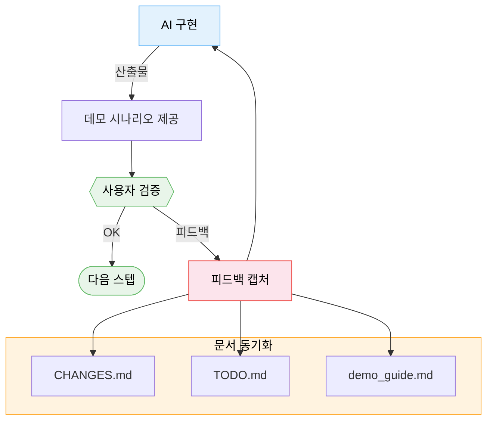
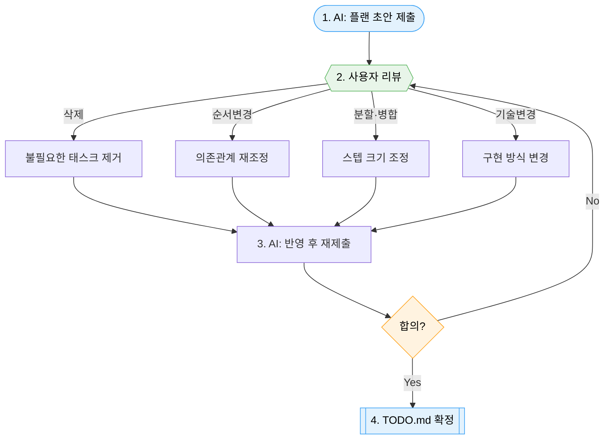

# Agentic Workflow — AI 에이전트와 함께 프로젝트를 체계적으로 진행하는 방법론

> Claude Code, Cursor, Copilot Agent 등 AI 코딩 에이전트와 중·장기 프로젝트를 진행할 때,
> **컨텍스트 유실 없이**, **작업 추적이 가능하며**, **사용자 검증이 포함된** 구조적 협업 프레임워크.

---

## 이 방법론이 해결하는 문제

AI 에이전트와 프로젝트를 진행하면 누구나 겪는 문제들이 있습니다:

| 문제 | 증상 | 원인 |
|------|------|------|
| **세션 간 기억 소실** | "어디까지 했더라?" 매번 처음부터 설명 | AI의 컨텍스트 윈도우는 세션마다 초기화됨 |
| **작업 상태 불투명** | 뭐가 완료됐고 뭐가 남았는지 모름 | 진행 상황이 대화 속에 파묻힘 |
| **요구사항 누락** | "그거 반영했어?" 세션 사이 추가 요청이 사라짐 | 변경사항을 캡처하는 구조가 없음 |
| **코드만 짜고 끝** | 테스트·문서·검증 없이 다음으로 넘어감 | 완료 기준이 모호함 |
| **피드백 반영 단절** | 사용자가 확인할 타이밍이 없음 | 구현→검증 사이클이 정의되지 않음 |

이 방법론은 **파일 기반 상태 관리** + **프로토콜** 조합으로 위 문제를 해결합니다.

---

## 전체 흐름

```mermaid
graph LR
    subgraph P0["Phase 0 · 플랜 협의"]
        direction TB
        A1(["요구사항 설명"])
        A2["AI: 플랜 초안"]
        A3{{"사용자 리뷰 & 편집"}}
        A4[["TODO.md 확정"]]
        A1 --> A2 --> A3 --> A4
    end

    subgraph P1["Phase 1 · 반복 실행"]
        direction TB
        B1[["CHANGES.md 확인"]]
        B2["코드 구현 + TDD"]
        B3["검증 + 문서 갱신"]
        B4(["사용자에게 보고"])
        B1 --> B2 --> B3 --> B4
    end

    subgraph P2["Phase 2 · 데모-피드백"]
        direction TB
        C1(["demo_guide 전달"])
        C2{{"사용자 데모 테스트"}}
        C3[["피드백 → CHANGES.md"]]
        C1 --> C2 --> C3
    end

    A4 ==> B1
    B4 ==> C1
    C3 -. "다음 스텝에서 반영" .-> B1

    style P0 fill:#e8f5e9,stroke:#66bb6a,color:#000
    style P1 fill:#e3f2fd,stroke:#42a5f5,color:#000
    style P2 fill:#fce4ec,stroke:#ef5350,color:#000
```



---

## 핵심 구성 요소

### 1. 문서 구조 (`toClaude/`)

AI 에이전트가 참조하는 모든 상태 정보를 프로젝트 내 파일로 관리합니다.

```
toClaude/
├── plan/
│   └── master_plan.md    # 전체 설계 + 단계별 명세
├── TODO.md               # 작업 목록 + 상태 (Single Source of Truth)
├── CHANGES.md            # 세션 간 변경/추가 요청 버퍼
├── CHECKLIST.md          # 단계별 검증 절차서 (테스트 매뉴얼)
├── demo_guide.md         # 사용자 데모 시나리오 + 실행법
├── log/                  # 현재 스텝 요약 (작성 후 archive로 이동)
└── archive/              # 완료된 스텝 요약 보관소
```

| 파일 | 역할 | 누가 쓰나 | 누가 읽나 |
|------|------|-----------|-----------|
| `master_plan.md` | 전체 설계, 기술 명세, 의존관계 | 사용자+AI 초기 협의 | AI (매 스텝 시작 시) |
| `TODO.md` | 작업 상태 추적 (유일한 체크박스) | AI (완료 시 `[x]`) | AI + 사용자 |
| `CHANGES.md` | 세션 간 변경 요청 큐 | 사용자 or AI | AI (세션 시작 시 필수 확인) |
| `CHECKLIST.md` | 각 스텝의 검증 절차 | AI (구현 전 작성) | AI + 사용자 (데모 시) |
| `demo_guide.md` | 사용자 데모 시나리오 | AI (스텝 완료 시) | 사용자 (데모 테스트 시) |

### 2. CLAUDE.md (행동 규칙)

프로젝트 루트의 `CLAUDE.md`에 에이전트 행동 규칙을 정의합니다. 이 파일이 방법론의 **실행 엔진**입니다.

포함하는 프로토콜:
- **Step Completion Protocol** — 코드 완료 ≠ 스텝 완료. 검증+문서까지 끝내야 완료
- **Ad-hoc Change Protocol** — 중간 변경 시 문서 동기화 강제
- **Session Start Protocol** — 새 세션에서 CHANGES.md 먼저 확인
- **Smart TDD Rule** — 새 로직은 테스트 먼저

### 3. 데모-피드백 사이클

이 방법론에서 가장 중요한 사이클입니다.



**왜 효과적인가:**

이 사이클은 Agile의 Sprint Review, Lean의 Build-Measure-Learn과 본질이 같습니다. 검증된 패턴이지만, AI 에이전트 작업 흐름에 맞게 세 가지가 구조화되어야 합니다:

1. **적정 스텝 크기** — 각 스텝이 "데모 가능한 단위"여야 합니다. 너무 크면 피드백이 늦고, 너무 작으면 오버헤드만 증가합니다.
2. **피드백의 구조적 캡처** — 데모 중 나온 요구사항이 CHANGES.md로 기록되어야 다음 세션에서 유실되지 않습니다.
3. **의사결정자의 직접 참여** — 데모를 보고 바로 판단할 수 있는 사람이 검증해야 사이클이 빠르게 돕니다.

데모 자체보다 **피드백이 캡처되고 반영되는 구조**가 핵심입니다. 데모만 하고 피드백이 정리되지 않으면 의미가 반감됩니다.

---

## 프로젝트 규모별 프리셋

모든 프로젝트에 전체 프로토콜을 적용하면 오버헤드가 과합니다. 규모에 맞게 선택하세요.

### Light (1~2일, 단순 기능/버그픽스)

```
사용 파일: TODO.md
CLAUDE.md: 최소 규칙 (완료 기준 + 세션 시작 시 TODO 확인)
데모 사이클: 구현 후 사용자에게 구두 확인
```

- 플래닝 오버헤드 거의 없음
- TODO.md 하나로 "어디까지 했지?" 문제만 해결
- 적합: 버그픽스, 소규모 기능 추가, 리팩터링

### Standard (1~2주, 중규모 기능 개발)

```
사용 파일: TODO.md + CHANGES.md + demo_guide.md
CLAUDE.md: Step Completion + Ad-hoc Change + Session Start Protocol
데모 사이클: 스텝마다 demo_guide 기반 사용자 테스트
```

- 세션 간 연속성 확보
- 중간 요구사항 변경 추적
- 적합: 새 기능 모듈, API 개발, UI 리뉴얼

### Full (2주 이상, 복잡한 시스템 구축)

```
사용 파일: 전체 (master_plan + TODO + CHANGES + CHECKLIST + demo_guide + log/archive)
CLAUDE.md: 전체 프로토콜 + TDD Rule + Archive Rule
데모 사이클: 스텝마다 체크리스트 기반 검증 + 데모 테스트 + 피드백 반영
Memory: cross-session 프로젝트 상태 추적
```

- 대규모 프로젝트의 모든 문제를 커버
- 문서 관리 오버헤드 있음 (작업 시간의 ~20~30%)
- 적합: 새 시스템 구축, 장기 프로젝트, 복잡한 아키텍처

---

## 작업 흐름 상세

### Phase 0: 프로젝트 초기화

```
1. 사용자가 프로젝트 목표와 요구사항을 설명
2. AI가 master_plan.md 초안 작성 (스텝/태스크 표 포함)
3. ★ 사용자가 플랜을 리뷰하며 편집 (아래 상세 참조)
4. 합의된 플랜으로 TODO.md 확정
5. CHECKLIST.md 작성 (각 스텝의 검증 절차)
6. CLAUDE.md에 프로토콜 규칙 설정 (프리셋 선택)
```

#### 플랜 협의 — 이 방법론의 출발점

Phase 0의 3번이 전체 프로젝트의 방향을 결정합니다.

**왜 중요한가:**

AI는 구조화를 잘합니다. 요구사항을 받으면 스텝/태스크 표로 깔끔하게 정리하고, 의존관계를 매핑하고, 산출물을 명시합니다. 하지만 **AI는 "No"를 못합니다.** 가능한 것을 전부 넣으려 하고, 스코프가 끝없이 커집니다.

반대로 사용자는 "지금 이건 안 해도 된다", "이 순서가 맞나?" 같은 **비즈니스 판단**을 합니다. AI가 기술적으로 가능한 것과 지금 실제로 필요한 것 사이의 간극을 사용자가 메웁니다.

**역할 분리:**

| AI의 역할 | 사용자의 역할 |
|-----------|-------------|
| 요구사항 → 표 구조화 | 불필요한 태스크 삭제 |
| 의존관계 매핑 | 스텝 순서 재조정 |
| 산출물 명시 | 스코프 축소/확대 판단 |
| 기술 명세 작성 | 우선순위 결정 |

**플랜 리뷰 진행 방법:**



**리뷰 시 자문할 질문 (체크리스트):**

| # | 질문 | 목적 |
|---|------|------|
| 1 | "이 태스크 없이도 목표를 달성할 수 있는가?" | 불필요한 태스크 제거 |
| 2 | "이 순서가 아니면 안 되는가?" | 의존관계 재확인, 병렬화 가능성 |
| 3 | "각 스텝이 데모 가능한 크기인가?" | 데모-피드백 사이클 보장 |
| 4 | "이 스텝의 완료 기준이 검증 가능한가?" | 모호한 완료 기준 방지 |
| 5 | "전체 스코프가 기한 내 현실적인가?" | 오버스코프 방지 |

> **주의**: AI가 만든 표는 깔끔하게 정리되어 있어서 "잘 짰네" 하고 그냥 승인하기 쉽습니다. 표가 예뻐 보인다고 내용이 맞는 것은 아닙니다. 반드시 위 질문을 하나씩 대입해 보세요.

### Phase 1: 반복 실행 (스텝 단위)

```
스텝 시작:
  1. CHANGES.md 확인 → 미처리 항목 우선 처리
  2. TODO.md에서 현재 스텝 확인
  3. master_plan에서 해당 스텝 명세 확인

구현:
  4. (TDD 적용 시) 테스트 먼저 작성
  5. 코드 구현
  6. 테스트 실행 → 전체 통과 확인

완료 처리:
  7. CHECKLIST.md 검증 항목 실행
  8. demo_guide.md에 데모 시나리오 추가
  9. TODO.md에서 완료 항목 [x] 체크
  10. 스텝 요약 작성 → archive/로 이동
  11. 사용자에게 보고 + 데모 안내
```

### Phase 2: 데모-피드백

```
  12. 사용자가 demo_guide.md 기반으로 직접 테스트
  13. 피드백 발생 → CHANGES.md에 기록
  14. 다음 스텝 시작 시 Phase 1의 1번에서 자동 반영
```

### 중간 변경 발생 시 (Ad-hoc)

```
사용자: "이거 좀 바꿔줘"
  1. 코드 수정
  2. (같은 턴에서) TODO.md에 항목 추가/체크
  3. (같은 턴에서) CHANGES.md에 기록
  4. (같은 턴에서) demo_guide.md 갱신 (UI 변경인 경우)
```

핵심: **코드 변경과 문서 동기화를 같은 턴에서 처리**. 나중에 하려면 잊어버립니다.

---

## 이 방법론이 효과적인 조건

솔직하게 말하면, 이 방법론은 **특정 조건**에서 최적입니다:

### 잘 맞는 경우
- AI 에이전트와 1:1 또는 소수 인원이 작업
- 의사결정자가 데모에 직접 참여 가능
- 여러 세션에 걸친 연속 작업
- 명확한 단계로 분할 가능한 프로젝트

### 주의가 필요한 경우
- **팀이 5명 이상**: 데모 후 합의 과정이 필요해 사이클이 느려짐
- **스텝 분할이 어려운 탐색적 작업**: R&D, 프로토타이핑에는 Full 대신 Light 권장
- **매우 작은 작업**: 1~2시간 단발성 작업에 Full 프로토콜은 과함

---

## 빠른 시작

### 1. 프리셋 선택

프로젝트 규모에 맞는 프리셋을 선택하세요:

| 프리셋 | 파일 |
|--------|------|
| Light | [`presets/CLAUDE_light.md`](presets/CLAUDE_light.md) |
| Standard | [`presets/CLAUDE_standard.md`](presets/CLAUDE_standard.md) |
| Full | [`presets/CLAUDE_full.md`](presets/CLAUDE_full.md) |

### 2. 템플릿 복사

`templates/` 폴더에서 필요한 파일을 프로젝트의 `toClaude/` 폴더로 복사하세요:

```bash
# Standard 기준
mkdir -p toClaude
cp templates/TODO.md toClaude/
cp templates/CHANGES.md toClaude/
cp templates/demo_guide.md toClaude/
```

### 3. CLAUDE.md 설정

선택한 프리셋을 프로젝트 루트에 복사하세요:

```bash
cp presets/CLAUDE_standard.md ./CLAUDE.md
```

### 4. 스킬 복사 (onTong 사용 시)

onTong에서 AI Copilot이 방법론을 자동 안내하게 하려면:

```bash
cp skills/프로젝트-셋업-도우미.md  wiki/_skills/프로젝트관리/
cp skills/스텝-진행-도우미.md      wiki/_skills/프로젝트관리/
```

스킬이 활성화되면:
- **"프로젝트 시작하려고 해"** → 셋업 도우미가 프리셋 추천 + 플랜 협의 진행
- **"다음 스텝 진행하자"** → 진행 도우미가 세션 시작 프로토콜 + 스텝 완료 처리 안내
- **"데모 테스트 하자"** → 진행 도우미가 피드백 수집 + 문서 동기화 안내

### 5. AI 에이전트와 작업 시작

```
사용자: "이 프로젝트를 시작하려고 해. toClaude/ 폴더의 구조를 확인하고,
        master_plan을 함께 작성하자."
```

---

## 폴더 구조

```
agentic-workflow/
├── README.md                      # 이 문서 (방법론 가이드)
├── templates/                     # 문서 템플릿
│   ├── TODO.md
│   ├── CHANGES.md
│   ├── CHECKLIST.md
│   ├── demo_guide.md
│   └── master_plan.md
├── presets/                       # CLAUDE.md 프리셋
│   ├── CLAUDE_light.md
│   ├── CLAUDE_standard.md
│   └── CLAUDE_full.md
└── skills/                        # onTong 스킬 (wiki/_skills/에 복사하여 사용)
    ├── 프로젝트-셋업-도우미.md      #   프로젝트 초기화 + 플랜 협의 가이드
    └── 스텝-진행-도우미.md          #   스텝 실행 + 데모-피드백 + 세션 이어하기
```

---

## 실제 적용 사례

이 방법론은 [onTong](https://github.com/Jeensh/onTong) 프로젝트에서 실전 검증되었습니다.

- **규모**: FastAPI + Next.js 15 풀스택, 310+ 태스크, 145개 자동화 테스트
- **기간**: 다수 세션에 걸친 연속 개발
- **프리셋**: Full
- **결과**: 세션 간 요구사항 누락 0건, 데모-피드백 사이클을 통한 즉각적 방향 수정

---

## 라이선스

MIT — 자유롭게 사용, 수정, 배포하세요.
