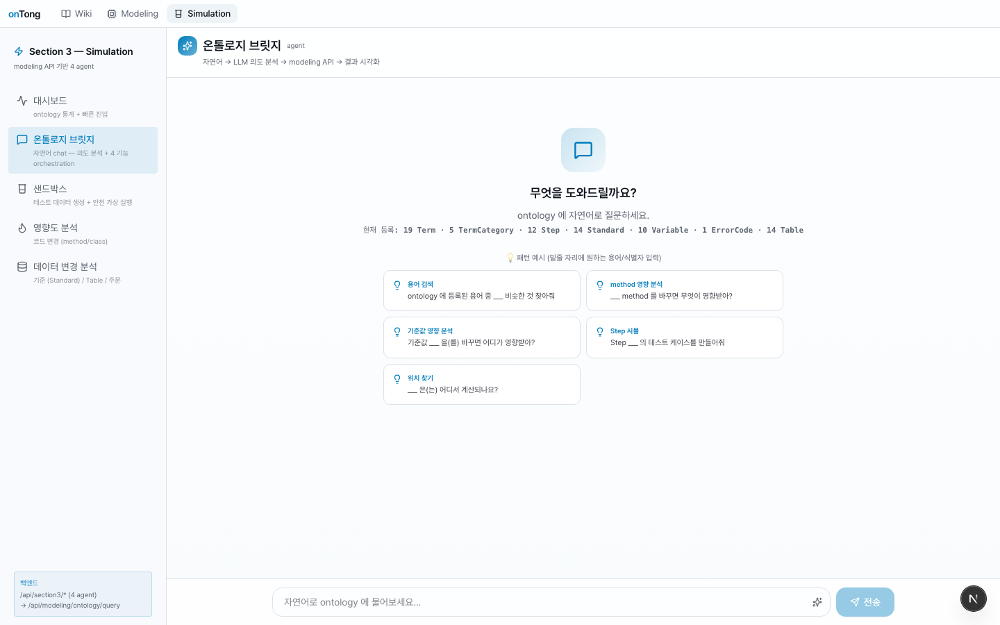
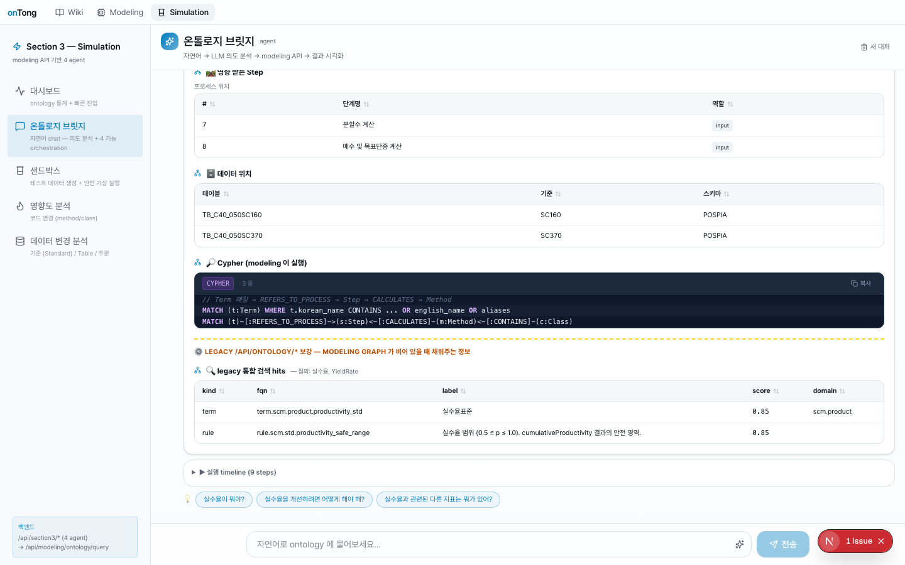

# Section 3 — Simulation

> **modeling Neo4j 적재 없이, ontology API 실시간 호출만으로**
> 자연어 질문 → 영향도 분석 → 테스트 케이스 → Python 실행까지 한 흐름으로 보여주는 모듈.

---

## 한 줄 요약

```
사용자 발화 / fqn 입력
   ↓
[1] OntologyComposer    legacy /api/ontology/* 실시간 호출 (병렬 7종)
   ↓
[2] JavaToPython AST    body_text → tree-sitter-java → Python source
   ↓
[3] Sandbox subprocess  case 별 격리 실행 → result · stdout · stderr
   ↓
UI: layer 단위 스트리밍 (Term · Step · Method · Table · Rule · Anchor)
```

---

## 1. 대시보드 — 빠른 진입


`/api/modeling/ontology/graph/stats` 응답을 그대로 노출.

- **75 nodes / 117 relations** 카운트, 분류별 chips
- 4개 메뉴 카드로 바로 진입
- 우측 상단의 **코드 (Class / Method) = 0** 이 modeling Neo4j 의 빈약함을 그대로 노출 → Section 3 가 legacy 로 보강함의 이유

---

## 2. 온톨로지 브릿지 (chat)



자연어 입력 → LLM 분류 (`impact_analysis` / `simulate` / `explain`) → task agent 호출.

확인 가능한 기능:
- 입력창 + 추천 patterns (generic, slab-design hardcoding ❌)
- SSE 단계별 스트리밍 (thinking · intent_classification · modeling_call · layer_scan · final)
- 답변에 RichResultCard (Java 소스 · 룰 · 그래프) 자동 attach

### 시연: "실수율이 어디서 계산되나?"



- modeling explain → matched_term `실수율 (YieldRate)` + Step 2개 + Table 2개
- legacy enrich → `term.scm.product.productivity_std` + `rule.scm.std.productivity_safe_range` 추가 hit
- modeling 자체로는 한국어 매칭이 약하나, composer 의 search 보강으로 정보량 두 배

---

## 3. 샌드박스 — composer + AST + subprocess


- `target_kind` 선택 (`step` / `method` / `class`)
- target_id 입력 (`step` 은 1-12 chip 자동 노출 — modeling graph_stats 의 Step 동기)
- 케이스 타입 3종 (normal / boundary / error)
- 코드 합성 + sandbox 실행 토글

### 시연: `ProductivityService.cumulativeProductivity` 메서드 시뮬


확인 가능한 결과:
- composer 가 `code-types/{class}` 에서 body_text, `code-methods/{fqn}/anchor-bindings` 에서 `DEFAULT_PRODUCTIVITY = 0.95` 추출
- tree-sitter-java AST → Python 변환 — `if (s == null || s.length() < 8)` 가 정확히 `if (s == None or len(s) < 8)` 로 변환
- 3 case 모두 실행 성공 — `result = 0.95` (Java 로직 그대로)
- 우측 하단에 **생성된 Python 코드** 그대로 노출 (사용자가 확인 가능)

---

## 4. 영향도 분석 — 코드 변경


- `target_kind` 선택 (`method` / `class` / `column`)
- method/class FQN 입력
- composer 가 7종 legacy endpoint 병렬 호출 → 영향 method · 룰 · anchor · 시각화 한 응답으로 합성

### 시연: `cumulativeProductivity` 변경 시 영향


확인 가능한 결과:
- **[HIGH]** 위험도 — 강제 룰 1건, hard severity (composer 가 enforced_by 매칭으로 산정)
- Ontology Graph 시각화 (`ProductivityService → cumulative_productivity action` 등 4 nodes 5 edges)
- summary: "cumulativeProductivity 변경 — action 1건 · 룰 1건 · anchor 7건"
- 아래 스크롤하면 legacy 보강 section (Java body_text + 비즈니스 룰 statement + anchor 라인 매핑) 등장

---

## 5. 데이터 변경 분석


- `target_kind` 선택 (`table` / `standard_value` / `order`)
- target_id 입력
- composer 가 `business-rules.statement` · `anchor-bindings.target_slot` 매칭 + `search` 통합 검색까지 한 호출 합성
- modeling 의 `impact_analysis(standard_value)` 의 분기 버그 (Section 2 측 #04 요청 사유) 를 우회

---

## 6. 백엔드 파이프라인 상세

### 6.1 호출 순서 (method kind 기준)

```
POST /api/section3/code-impact { target_kind:"method", target_id:"...cumulativeProductivity(...)" }
 ├─ thinking "코드 영향도 — method=..."
 ├─ modeling_call "composer.impact_analysis"
 ├─ [composer] 병렬 fetch (5 endpoints)
 │    ├─ GET /api/ontology/code-types/{class_fqn}
 │    ├─ GET /api/ontology/code-methods/{fqn}/anchor-bindings
 │    ├─ GET /api/ontology/code-methods/{fqn}/call-sites
 │    ├─ GET /api/ontology/business-rules?repo_id=slab-design-real
 │    └─ GET /api/ontology/repos/slab-design-real/modules/inventory/actions
 ├─ modeling_result (composer 합성 응답)
 ├─ layer_scan "영향 메서드"     (1 item)
 ├─ layer_scan "비즈니스 룰"     (1 item — productivity_safe_range)
 ├─ layer_scan "anchor (라인 매핑)" (7 items)
 ├─ layer_scan "call-sites"      (1 item)
 ├─ layer_scan "owning actions"  (1 item — cumulative_productivity)
 └─ final {risk: HIGH, summary, legacy_enrich, visualization}
```

### 6.2 sandbox method kind 의 6 단계

```
POST /api/section3/sandbox/run { target_kind:"method", target_id:"...", case_types:["normal","boundary","error"] }
 ├─ thinking
 ├─ modeling_call "composer.simulate"
 ├─ [composer.simulate_method] fetch
 │    ├─ GET /api/ontology/code-types/{class_fqn}   → methods.body_text + fields
 │    └─ GET /api/ontology/code-methods/{fqn}/anchor-bindings  → DEFAULT_PRODUCTIVITY = 0.95
 ├─ modeling_result (composer)
 ├─ thinking "Java body_text → tree-sitter AST → Python 변환 중…"
 ├─ code_gen (transpiled Python source 1447b)
 ├─ sandbox_run "3 case 격리 실행"
 ├─ sandbox_result [
 │    { case_id:"_N", input:{...ABC}, stdout:'{"ok":true,"result":0.95}' },
 │    { case_id:"_B", input:{..."" }, stdout:'{"ok":true,"result":0.95}' },
 │    { case_id:"_E", input:{...None},stdout:'{"ok":true,"result":0.95}' }
 │  ]
 └─ final {summary, generated_python, sandbox_result}
```

---

## 7. Section 3 단독으로 만든 자체 자산

| 파일                                       | 줄수 | 역할                                                       |
| ------------------------------------------ | ---- | ---------------------------------------------------------- |
| `backend/section3/composer.py`             | 471  | legacy /api/ontology/* 만으로 응답 합성기                    |
| `backend/section3/transpiler.py`           | 288  | tree-sitter-java AST → Python                              |
| `backend/section3/agents/*.py` (4 agent)   |      | bridge / sandbox / code-impact / data-impact 모두 composer 사용 |
| `backend/section3/clients/modeling_client.py` |   | 11개 legacy endpoint wrapper 추가                            |
| `frontend/src/components/section3/rich/RichResultCard.tsx` |    | legacy_enrich section UI                              |

---

## 8. 사용자 명시 요구 vs 현재 상태

| 사용자 메시지                                                                                       | 현재 상태                                          |
| --------------------------------------------------------------------------------------------------- | ---------------------------------------------------- |
| "Section 2 코드 절대 안 건드림!"                                                                    | ✅ Section 3 만 수정. Section 2 변경 0건             |
| "적재해서 읽는 방식이 아니라, 처음부터 ontology API 호출 후 그 응답을 가지고 작업이 되게끔 개편"   | ✅ Composer 가 매 호출 legacy API 실시간 호출         |
| "모든 온톨로지가 제공하는 api 를 호출만 딱 하고, 호출된 것들의 응답을 철저히 분석해서 진행"        | ✅ 49 endpoint × multi-variant (총 127 raw 응답)     |
| "실시간으로 ontology api 를 호출하고 그 응답을 바탕으로 ast 파싱을 하고 python 코드로 실행"        | ✅ composer → tree-sitter-java AST → Python subprocess |
| "꼭 필요한 것만 따로 요청할 문서를 자세히 작성"                                                     | ✅ `SECTION2_REQUEST_ESSENTIAL.md` (3건만)            |

---

## 9. 관련 문서

- 📋 [`WORK_REPORT.md`](./WORK_REPORT.md) — 작업 보고서 (전체)
- 🔍 [`ONTOLOGY_API_AUDIT.md`](./ONTOLOGY_API_AUDIT.md) — 49 endpoint × variant 호출 감사
- 📤 [`SECTION2_REQUEST_ESSENTIAL.md`](./SECTION2_REQUEST_ESSENTIAL.md) — Section 2 에 정말 필요한 3건만
- 📚 [`SECTION2_REQUESTS.md`](./SECTION2_REQUESTS.md) — 누적 요청 인덱스 (기존 7건 보류 상태)
