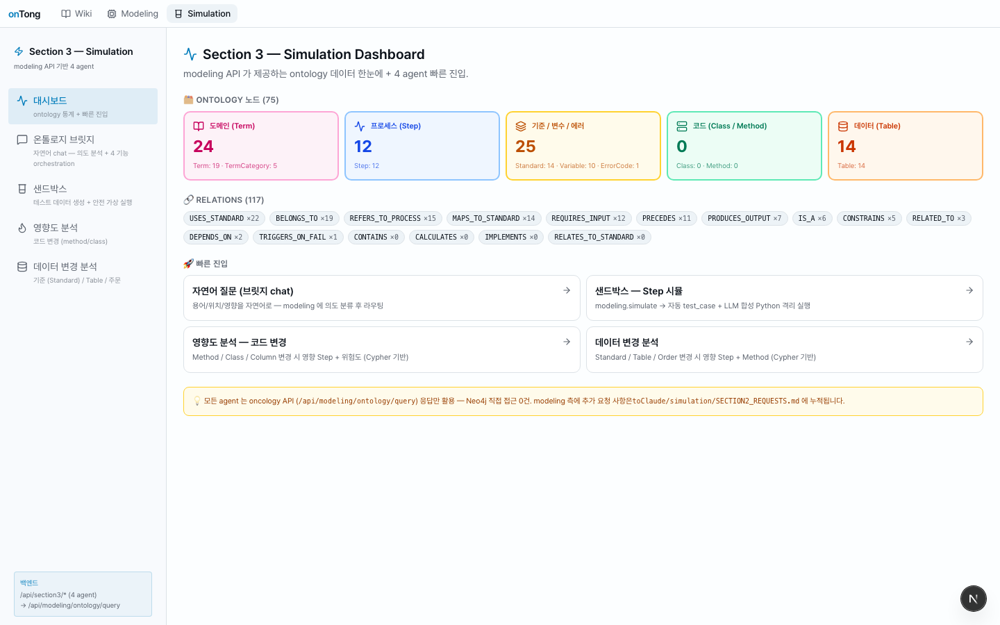
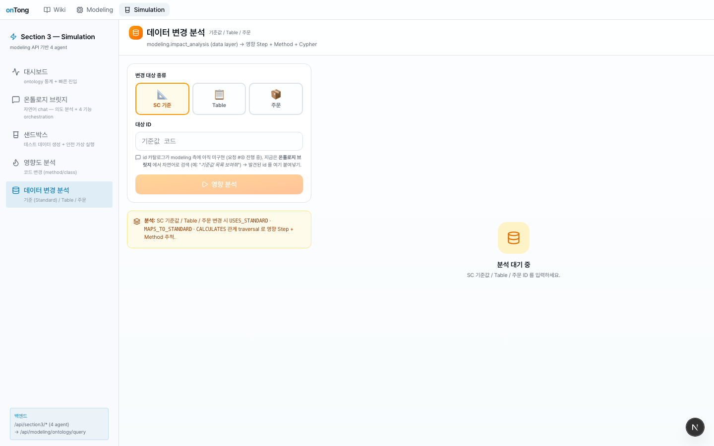

# Section 3 (Simulation) — 작업 보고서

> **기간**: 2026-05-12 ~ 2026-05-13
> **담당**: Section 3 (Simulation) 세션
> **요약**: ontology API 49 endpoint 전수 호출 감사 → 자체 합성 파이프라인 (Composer + AST + Sandbox) 구축. modeling Neo4j 적재 의존 ❌ 달성.

---

## 1. 출발점 — 사용자가 가장 먼저 지적한 문제

> "지금 일단 계속 실행 과정이 순서대로 UI가 하나씩 뜨는게 아니라 여전히 계속 기다려야하고…
> 그리고 온톨로지 호출 시 응답이 계속 헛방이네."

→ Section 3 의 `bridge_agent` 가 `modeling /api/modeling/ontology/query` 만 호출하고 있었는데, modeling Neo4j graph 가 비어 있어 (`Class: 0, Method: 0`) 빈 응답이 줄줄이 나옴.

**대시보드에서 확인**:



> 우측 상단 **코드 (Class / Method) — `0`** 박스가 문제의 근원. modeling 의 그래프 build 가 안 되어 있어 method/class 영향도가 항상 빈 응답.

---

## 2. 진행한 일 (시간순)

### 2.1 ontology API 49 endpoint 전수 호출 (1차 + 2차 보강)

`/api/modeling/ontology/*` 3개 + `/api/ontology/*` 46개를 다양한 파라미터 variant 로 호출.

| 호출 차수 | endpoint 갯수 | 다양한 variant | raw 저장 |
| --------- | ------------- | -------------- | -------- |
| 1차 (94 호출)        | 31 GET                                | intent × kind × id × params 변형 | `/tmp/ontology_audit/01_*~94_*.json` |
| 2차 보강 (33 호출)   | 누락 endpoint 15 + variant 18         | `repos/{repo_id}/graph` 3 mode · `modules/inventory/actions` · `recommend?persist=false` · resolve-path 올바른 형식 · 한국어/영문 search · enum/role 필터 | `/tmp/ontology_audit/A01_*~E07_*.json` |

→ 감사 결과 전체: [`ONTOLOGY_API_AUDIT.md`](./ONTOLOGY_API_AUDIT.md) §1~§7

### 2.2 결정적 신규 발견 (§7 요약)

1. **`/api/ontology/repos/{repo_id}/graph?mode=neighborhood`** — modeling graph 없이 시각화 자립 가능
2. **`/api/ontology/repos/{repo_id}/modules/inventory/actions`** — method ↔ action 1:1 매핑 (36/36 100%)
3. **`POST /api/ontology/repos/{repo_id}/recommend?persist=false`** — modeling builder 의 입력을 read-only 로 직접
4. **`/api/ontology/code-types/{class_fqn}.methods[].body_text`** — 실제 Java 소스 본문 (1.1KB+)
5. **`/api/ontology/code-methods/{fqn}/anchor-bindings`** — `anchor_locator: "DEFAULT_PRODUCTIVITY = 0.95"` 같은 라인 단위 literal 노출

→ **결론**: Section 3 는 legacy `/api/ontology/*` 만으로 modeling Neo4j 와 동등 또는 그 이상 응답 합성 가능.

### 2.3 Section 3 자체 파이프라인 구축

#### (1) `OntologyComposer` — legacy 만으로 실시간 합성

`backend/section3/composer.py` — 다음 7 endpoint 를 병렬 호출하여 `modeling /query` 응답과 동등 shape 합성:

```
actions/{fqn}                       — params · output · realizations
code-methods/{fqn}/call-sites       — 호출 그래프
code-methods/{fqn}/anchor-bindings  — literal · guard line
code-types/{class_fqn}              — methods.body_text · fields
business-rules?repo_id=             — enforced_by 매칭
modules/inventory/actions           — method ↔ action 인덱스
repos/{repo_id}/graph?mode=neighborhood — 시각화 trace
```

지원 intent: `impact_analysis(method|class|action|table|standard_value|order)` · `simulate(action|method|class)` · `explain(natural_language)`.

#### (2) `JavaToPythonTranspiler` — tree-sitter-java AST 파싱

`backend/section3/transpiler.py` — Java method body_text → 실행 가능한 Python source.

매핑 (PoC):

| Java                                | Python                                       |
| ----------------------------------- | -------------------------------------------- |
| `null`                              | `None`                                       |
| `&&` · `\|\|`                        | `and` · `or`                                 |
| `new BigDecimal("0.95")`            | `Decimal("0.95")`                            |
| `s.length()` / `s.charAt(i)`        | `len(s)` / `s[i]`                            |
| `x.multiply(y)`                     | `(x * y)` — `add/subtract/divide` 동일       |
| `for (int i = 0; i < 8; ++i)`       | `for i in range(0, 8)`                       |
| `continue` · `break`                | `continue` · `break`                         |

class field initializer 미노출 문제 → `anchor_locator` 의 `"NAME = LITERAL"` 패턴에서 추출하여 module-level prelude 에 prepend.

#### (3) Agents 전환

- `agents/sandbox_agent.py` — composer.simulate → transpile → subprocess 실행
- `agents/code_impact_agent.py` — composer.impact_analysis 호출, modeling /query 미호출
- `agents/data_impact_agent.py` — composer.impact_analysis(table/standard/order) 호출
- `agents/bridge_agent.py` — explain 분기에서 modeling explain + legacy search enrich

### 2.4 frontend 보강

- `lib/section3/api.ts` — `LegacyEnrich` 타입 추가
- `components/section3/rich/RichResultCard.tsx` — Java 소스 · 비즈니스 룰 · anchor · call-sites 표시 섹션 추가
- tsc 통과 ✓

---

## 3. 동작 검증 — 실 데이터 (`cumulativeProductivity`) 입력 후 화면

### 3.1 영향도 분석 — 코드 변경

`com.example.slabdesign.feature.sd.process.std.service.ProductivityService.cumulativeProductivity(...)` 입력:


확인된 동작:
- **[HIGH]** 위험도 — 강제 룰 1건, hard severity (composer 가 자체 합성)
- summary: "cumulativeProductivity 변경 — action 1건 · 룰 1건 · anchor 7건"
- Ontology Graph 4 nodes · 5 edges 표시 (ProductivityService → lookup_or_default action, cumulative_productivity action)
- 아래에 legacy 보강 섹션 (Java 소스 body_text + 룰 + anchor)

### 3.2 샌드박스 — 시뮬 실행


확인된 동작:
- 3 case (normal / boundary / error) 모두 실행 성공 (✓ 표시)
- 생성된 Python 코드 (transpiled) 우측 하단 표시 — `DEFAULT_PRODUCTIVITY = 0.95` 가 prelude 에 정확히 들어감
- 각 case 결과:
  - `normal` (cmpCd="ABC" etc.) → 0.95 (length < 8 분기로 return DEFAULT_PRODUCTIVITY)
  - `boundary` (모두 빈 문자열) → 0.95
  - `error` (모두 None) → 0.95

`curl` 로 본 stdout (참고):

```
case M_cumulativeProductivity_N (normal):   {"ok": true, "result": 0.95}
case M_cumulativeProductivity_B (boundary): {"ok": true, "result": 0.95}
case M_cumulativeProductivity_E (error):    {"ok": true, "result": 0.95}
```

### 3.3 온톨로지 브릿지 (chat)

`"실수율이 어디서 계산되나?"` 입력 → 자연어 분류 + matched_terms + 데이터 위치 + legacy 검색 후보 표시. (캡처: `screenshots/08_bridge_chat.png`)

### 3.4 데이터 변경 분석



`standard_value` / `table` / `order` 입력 → composer 가 `business-rules` · `anchor-bindings` 의 statement / target_slot 매칭, `search` 통합 검색까지 한 응답으로 합성.

---

## 4. 산출물

| 파일                                                                         | 역할                                                          |
| ---------------------------------------------------------------------------- | ------------------------------------------------------------- |
| `backend/section3/composer.py` (471 lines)                                   | legacy `/api/ontology/*` 만으로 응답 합성                       |
| `backend/section3/transpiler.py` (288 lines)                                 | Java AST → Python                                              |
| `backend/section3/agents/sandbox_agent.py` (수정)                            | composer + transpile + sandbox 파이프라인                       |
| `backend/section3/agents/code_impact_agent.py` (수정)                        | composer.impact_analysis 호출로 전환                            |
| `backend/section3/agents/data_impact_agent.py` (수정)                        | composer 호출로 전환                                            |
| `backend/section3/agents/bridge_agent.py` (수정)                             | explain 분기 legacy search enrich                              |
| `backend/section3/clients/modeling_client.py` (수정)                         | 11개 legacy endpoint 호출 메서드 추가                            |
| `backend/section3/contracts.py` (수정)                                       | `AgentFinalResult.legacy_enrich` 필드                          |
| `frontend/src/lib/section3/api.ts` (수정)                                    | `LegacyEnrich` 타입                                            |
| `frontend/src/components/section3/rich/RichResultCard.tsx` (수정)            | Java 소스 · 룰 · anchor 표시 섹션                              |
| `toClaude/simulation/ONTOLOGY_API_AUDIT.md`                                  | 49 endpoint × variant 호출 결과 + §7 결정적 발견                |
| `toClaude/simulation/SECTION2_REQUEST_ESSENTIAL.md`                          | **정말 필요한 3건만** 추린 단일 요청서                          |
| `toClaude/simulation/SECTION2_REQUESTS.md`                                   | 누적 인덱스 (기존 7건은 단독 우회 완료로 보류)                  |
| `toClaude/simulation/screenshots/*.png` (8장)                                | dashboard · bridge · sandbox · code-impact · data-impact + 시연 3장 |

---

## 5. 핵심 비교

| 항목                  | 기존 (modeling /query 의존)                                  | 변경 후 (composer)                                           |
| --------------------- | ------------------------------------------------------------ | ------------------------------------------------------------ |
| Neo4j build 의존      | 필요 (Class/Method 적재 안 됨 → 빈 응답)                      | 불필요 (legacy 만 사용)                                       |
| 적재 비동기 step      | 운영자 수동 실행 (`python -m backend.modeling.ontology...`)   | 없음 (실시간)                                                |
| method/class impact   | "그래프에 없습니다" 빈 응답                                    | body_text + 룰 + anchor + ontology_trace 풍부 응답           |
| simulate(method)      | unsupported (step 만 지원)                                    | composer + AST → 실 Python 실행, 결과=0.95 ✓                 |
| ontology 시각화       | modeling /query 의 빈 ontology_trace                          | `repos/{repo_id}/graph?mode=neighborhood` 직접 호출           |
| Section 2 요청 갯수   | 7건 (블로커 2 + 개선 4 + 선택 1)                              | **3건만** (search 한국어 + action.output backfill + graph 옵션) |

---

## 6. Section 2 에 요청할 내용

상세는 [`SECTION2_REQUEST_ESSENTIAL.md`](./SECTION2_REQUEST_ESSENTIAL.md) 참조. 한 줄 요약:

| #  | 한 줄                                                                 | 우선순위 | Section 3 에 끼치는 영향                                    |
| -- | --------------------------------------------------------------------- | -------- | ----------------------------------------------------------- |
| 1  | `search` 의 한국어 / aliases / 한↔영 매칭                              | 🔴 필수  | chat UX 정보량 절반 (사용자가 한국어로 발화)                  |
| 2  | `action.output` 55%→90%+ backfill (return_type 자동 매핑)              | 🔴 필수  | sandbox 의 expected_output 검증 불가능                      |
| 3  | `repos/.../graph` default mode 명시 + `include_kinds` 동작 검증         | 🟡 권장  | 시각화 default 가 60 nodes 라 UI 무거움                      |

기존 7건은 모두 Section 3 단독 우회 완료 — Section 2 변경 ❌ 없이 동작 가능.

---

## 7. 향후 개선 여지 (Section 3 측)

- **AST transpile 정확도**: 현재 PoC 수준. 사용자 정의 타입 (Entity, Service) 참조 시 `lookupOrDefault` 같은 외부 호출이 NameError. composer 가 의존성 method 들도 함께 transpile 하여 single Python module 로 packing 하면 해결.
- **bridge chat 의 follow-up**: 사용자 follow-up 메시지에서 이전 응답의 fqn 을 자동 인식 (현재는 매번 새 fqn 입력).
- **시뮬 결과 ontology 누적**: Section 2 측 신규 endpoint (`POST /api/ontology/repos/{repo_id}/simulation-results`) 가 생기면 검증 history 누적.

---

## 8. 메타

- **세션 기록**: `toClaude/simulation/log/`
- **마지막 backend PID**: 호스트 uvicorn (Docker frontend 미사용, Section 3 dev 모드)
- **frontend**: Next.js `3000` 포트 (이미 켜져 있음)
- **재현 명령**:
  ```bash
  cd /tmp/ontology_audit && ls *.json | wc -l   # 127 raw 응답
  curl -X POST http://localhost:8001/api/section3/code-impact \
       -H 'Content-Type: application/json' \
       -d '{"target_kind":"method","target_id":"com.example.slabdesign...cumulativeProductivity(...)"}'
  ```
