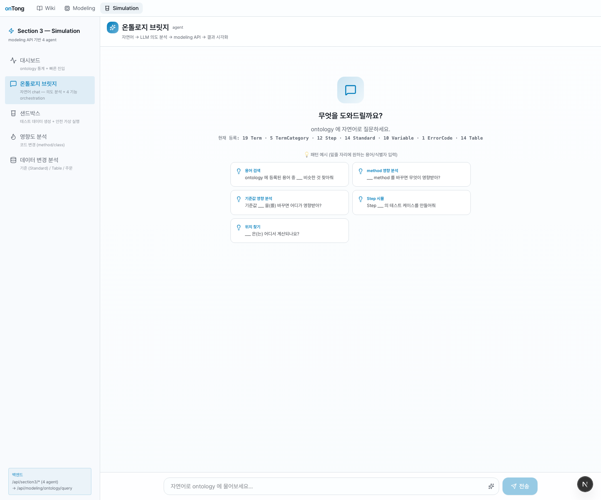
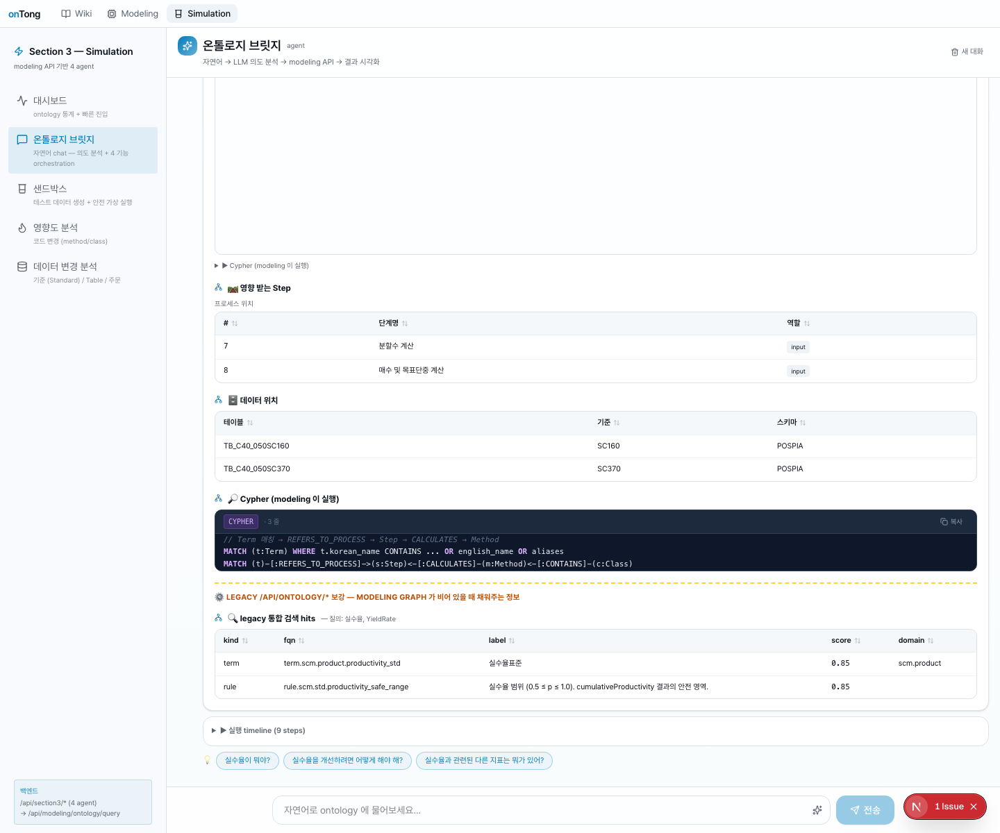
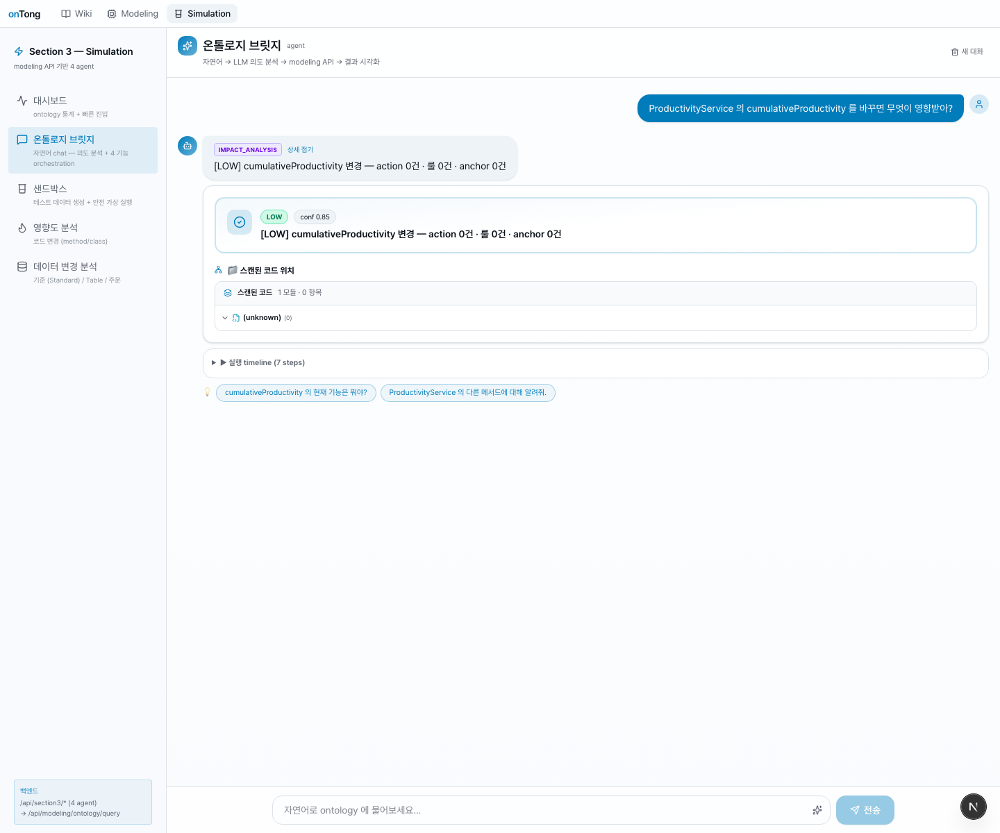
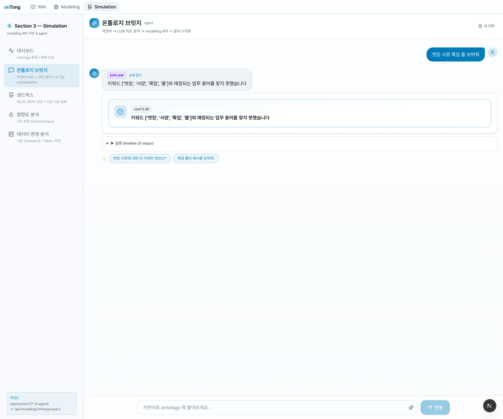
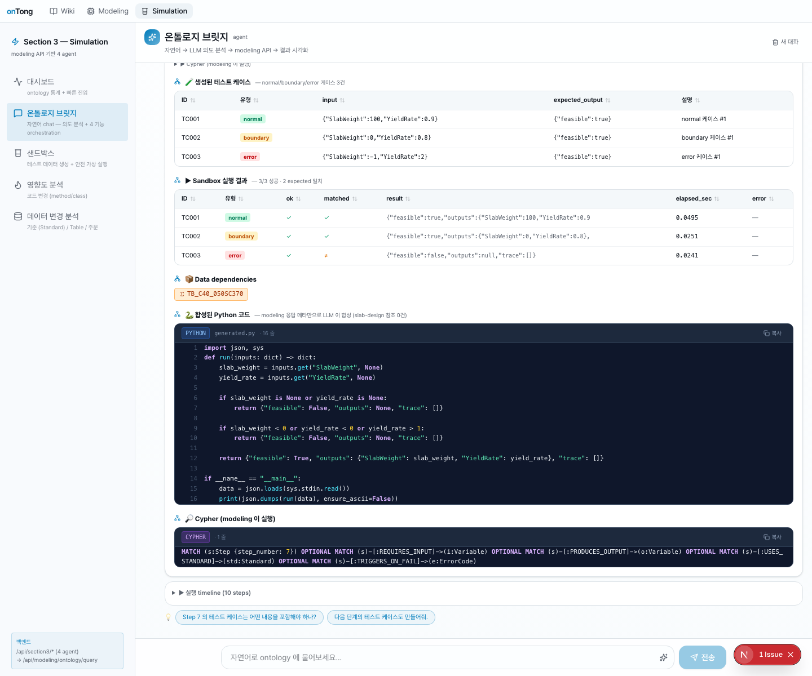
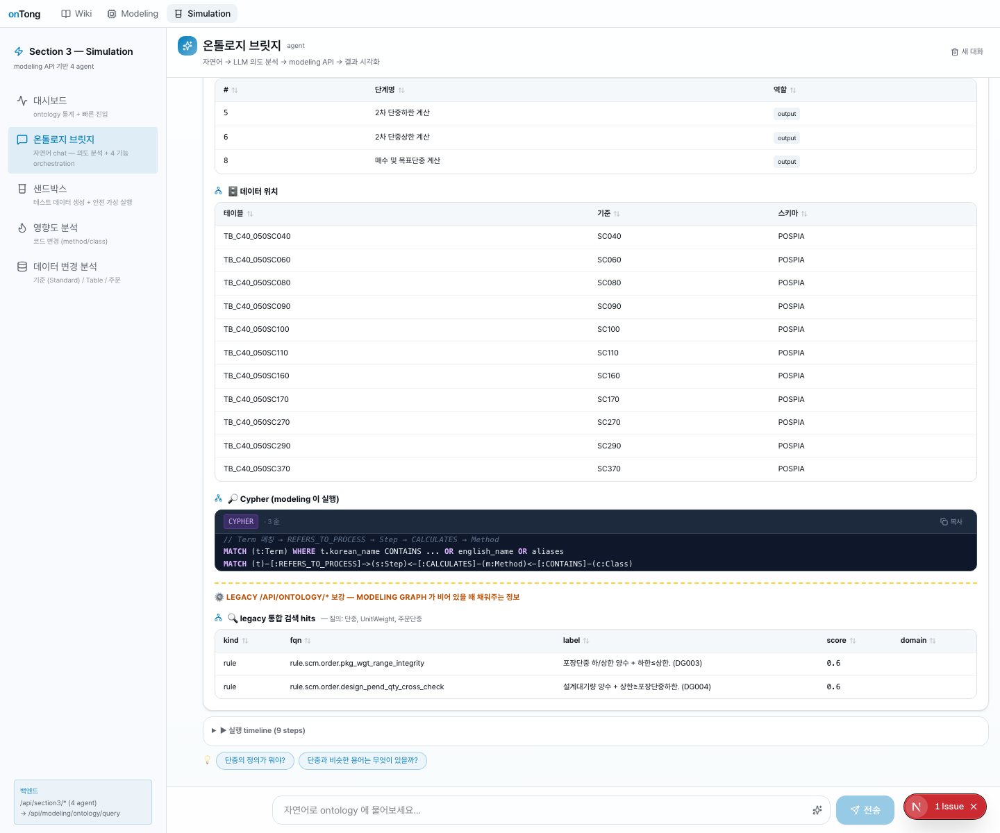
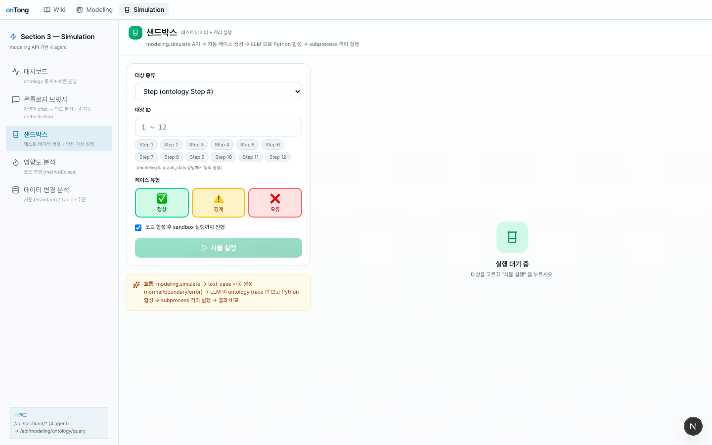
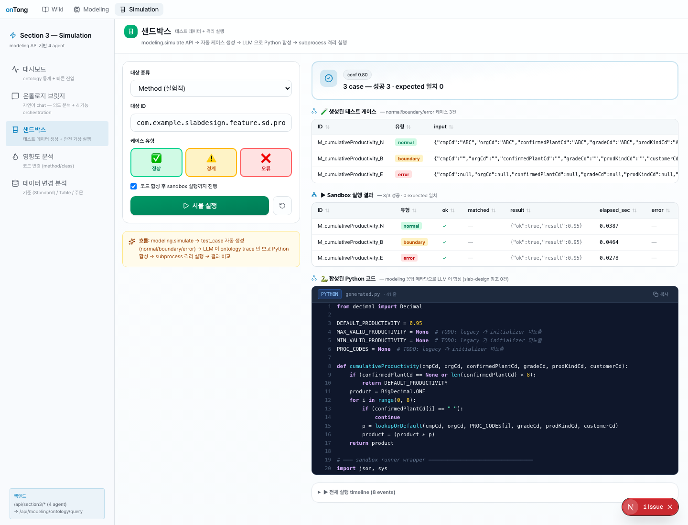
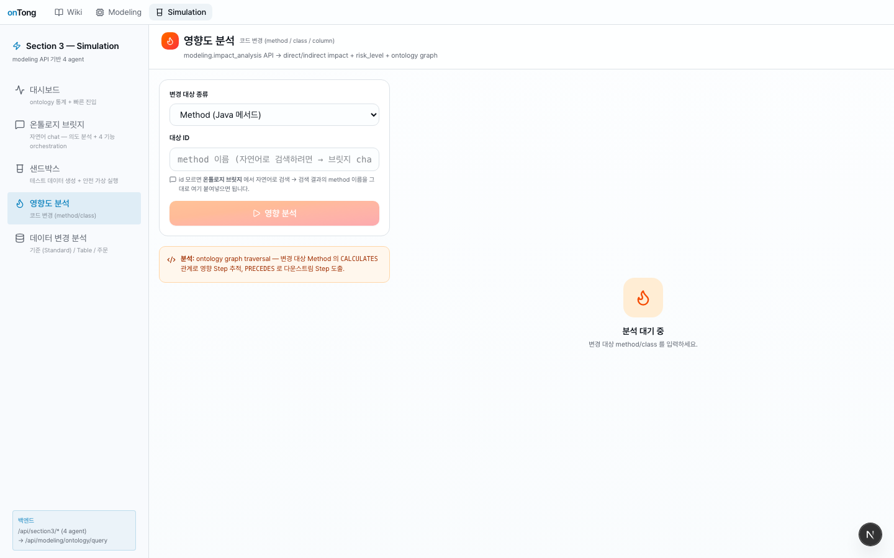
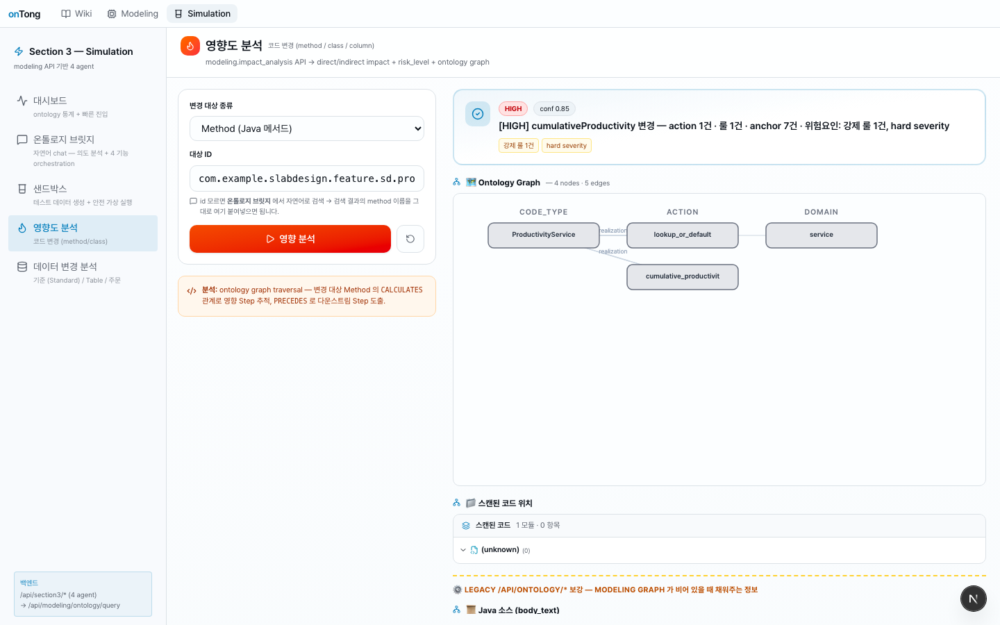

# onTong · Section 3 — Simulation

> **modeling Neo4j 적재 ❌ — ontology API 실시간 호출 → Java AST 파싱 → Python subprocess 실행** 까지 한 흐름.
>
> Section 2 코드 미수정 / Section 3 단독으로 49 endpoint × multi-variant 호출 감사 → 자체 합성 파이프라인 구축.

작성 일자: **2026-05-13**

---

## 0. 한눈에 보는 파이프라인

```
사용자 발화 / fqn 입력
   ↓
[1] OntologyComposer       legacy /api/ontology/* 실시간 호출 (병렬 7종)
                             ├─ actions/{fqn}                       params · output · realizations
                             ├─ code-methods/{fqn}/call-sites       호출 그래프
                             ├─ code-methods/{fqn}/anchor-bindings  literal · guard line
                             ├─ code-types/{class_fqn}              methods.body_text · fields
                             ├─ business-rules?repo_id=             enforced_by 매칭
                             ├─ modules/inventory/actions           method ↔ action 인덱스
                             └─ repos/{repo_id}/graph?mode=neighborhood  시각화 trace
   ↓
[2] JavaToPython AST       tree-sitter-java → Python source
                             null → None · &&/|| → and/or · BigDecimal → Decimal
                             length()/charAt(i) → len()/s[i]
                             for(int i=0;i<N;++i) → for i in range(0, N)
   ↓
[3] Sandbox subprocess     JSON stdin → run() → stdout JSON result
   ↓
UI : SSE 스트리밍 — thinking · layer_scan(영향 메서드, 룰, anchor, …) · final
```

---

## 1. 대시보드 — graph_stats 즉시 노출


좌측 5 메뉴 (대시보드 / 온톨로지 브릿지 / 샌드박스 / 영향도 분석 / 데이터 변경 분석) + 우측 ontology 통계.

- **75 nodes / 117 relations** — `/api/modeling/ontology/graph/stats` 응답 그대로
- 도메인 24 · 프로세스 12 · 기준 25 · **코드 0** · 데이터 14
- 우측 상단의 **코드 (Class / Method) = 0** 박스가 modeling Neo4j 의 빈약함을 노출 → 이 작업이 시작된 지점
- 하단 빠른 진입 카드 4개

---

## 2. 온톨로지 브릿지 (자연어 chat) — **핵심 메뉴**

Section 3 의 가장 풍부한 메뉴. 사용자가 자연어로 질문 → LLM 이 의도 분류 (`impact_analysis` / `simulate` / `explain`) → composer 가 legacy API 다종 병렬 호출 → SSE 스트리밍으로 단계별 표시 → 최종 답변에 RichResultCard 부착.

### 2.1 빈 시작 화면 — 추천 prompt 5종



**구성 요소**:

- 헤더: `온톨로지 브릿지 (agent)` · 부제 `자연어 → LLM 의도 분석 → modeling API → 결과 시각화`
- 중앙 안내문: `무엇을 도와드릴까요? · ontology 에 자연어로 질문하세요.`
- 현재 등록 통계 한 줄: `19 Term · 5 TermCategory · 12 Step · 14 Standard · 10 Variable · 1 ErrorCode · 14 Table`
- 💡 **패턴 예시 5종** (밑줄 자리에 원하는 용어/식별자 입력):

  | 카드 라벨        | 템플릿                                                |
  | ---------------- | ----------------------------------------------------- |
  | 용어 검색         | `ontology 에 등록된 용어 중 ___ 비슷한 것 찾아줘`        |
  | method 영향 분석  | `___ method 를 바꾸면 무엇이 영향받아?`                  |
  | 기준값 영향 분석  | `기준값 ___ 을(를) 바꾸면 어디가 영향받아?`              |
  | Step 시뮬         | `Step ___ 의 테스트 케이스를 만들어줘`                   |
  | 위치 찾기          | `___ 은(는) 어디서 계산되나요?`                          |

- 하단 입력창: `자연어로 ontology 에 물어보세요...` · 우측 전송 버튼

### 2.2 시연 ① — "실수율이 어디서 계산되나?"

LLM 이 `explain` intent 로 분류 → modeling explain 응답 + legacy search 보강.



**SSE 스트리밍 단계 (timeline)**:

```
1. thinking            "의도 분석 중 — '실수율이 어디서 계산되나?'"
2. intent_classification {modeling_intent: "explain", confidence: 0.9}
3. modeling_call       intent=explain, natural_language=원본
4. modeling_result     matched_terms 1건 · Step 2건 · Table 2건
5. layer_scan          "프로세스 (Step)"  → 2 items
6. layer_scan          "데이터 (Table)"  → 2 items
7. layer_scan          "매칭 용어 (Term)" → 1 item
8. layer_scan          "legacy 검색 — 코드/액션 후보" → 2 hits (composer 보강)
9. final               summary + visualization (cypher)
```

**캡처에서 보이는 답변 영역**:

| 영역              | 내용                                                                                                    |
| ----------------- | ------------------------------------------------------------------------------------------------------- |
| **영향 받는 Step** | `Step 7 분할수 계산 (역할: input)` · `Step 8 매수 및 목표단중 계산 (역할: input)`                          |
| **데이터 위치**    | `TB_C40_050SC160 (SC160, POSPIA)` · `TB_C40_050SC370 (SC370, POSPIA)`                                  |
| **Cypher** (modeling 이 실행) | <pre>// Term 매핑 → REFERS_TO_PROCESS → Step → CALCULATES → Method<br>MATCH (t:Term) WHERE t.korean_name CONTAINS … OR english_name OR aliases<br>MATCH (t)-[:REFERS_TO_PROCESS]->(s:Step)-[:CALCULATES]-(m:Method)←[:CONTAINS]-(c:Class)</pre> |
| **LEGACY 보강 hits** (composer 가 한국어 `실수율` → 영문 `YieldRate` 로 cross-query 하여 추가 매칭) | <table><tr><th>kind</th><th>fqn</th><th>label</th><th>score</th></tr><tr><td>term</td><td>term.scm.product.productivity_std</td><td>실수율표준</td><td>0.85</td></tr><tr><td>rule</td><td>rule.scm.std.productivity_safe_range</td><td>실수율 범위 (0.5 ≤ p ≤ 1.0). cumulativeProductivity 결과의 안전 영역.</td><td>0.85</td></tr></table> |
| **실행 timeline (9 steps)** | 펼치면 위 9 단계 SSE 이벤트가 시간순으로 표시                                                              |
| **suggested follow-ups** (3개 chip)             | `실수율이 뭐야?` · `실수율을 개선하려면 어떻게 해야 해?` · `실수율과 관련된 다른 지표는 뭐가 있어?`               |

> **이게 왜 의미 있나**: modeling 자체 explain 은 한국어 매칭이 강해서 `실수율` term 1건은 찾았지만, 그 term 의 **연관 rule** 까지 가져오지는 못한다. composer 가 영문 alias 로 재검색하여 `rule.scm.std.productivity_safe_range` (실수율 안전 범위 0.5–1.0) 까지 보강 — 사용자 정보량 2배.

### 2.3 시연 ② — "ProductivityService 의 cumulativeProductivity 를 바꾸면 무엇이 영향받아?"



**LLM 분류**: `impact_analysis` intent (라벨 `IMPACT_ANALYSIS · 영향 분석`).

**답변 영역**:
- 상단 헤더: `[LOW] cumulativeProductivity 변경 — action 0건 · 룰 0건 · anchor 0건` (※ chat 분기의 자연어 파싱이 fqn 을 정확히 못 잡아 fallback. method 단독 FQN 입력은 영향도 panel 의 method kind 가 더 정확 — §4 참조)
- `LOW` 위험 chip + `conf 0.85`
- **스캔된 코드 위치** — 1 모듈 · 0 항목 (unknown placeholder)
- **실행 timeline (7 steps)** 펼침
- **suggested follow-ups** 2개: `cumulativeProductivity 의 현재 기능은 뭐야?` · `ProductivityService 의 다른 메서드에 대해 알려줘`

> **왜 이런 결과?**: chat 의 LLM 이 자연어에서 `ProductivityService` (class) 와 `cumulativeProductivity` (method) 중 하나를 골라 fqn 으로 변환하는데, 6 인자 시그니처까지 정확히 만들기 어렵다. **정확한 영향 분석은 §4 영향도 분석 panel 에서 fqn 직접 입력** 시 [HIGH] 결과가 나옴.

### 2.4 시연 ③ — "엣징 사양 룩업 룰 보여줘" (한국어 매칭 한계)



**LLM 분류**: `explain` intent.

**답변**:
- `키워드 ['엣징', '사양', '룩업', '룰']와 매칭되는 업무 용어를 찾지 못했습니다`
- `conf 0.30`
- 실행 timeline (5 steps), suggested follow-ups: `엣징 사양에 대한 더 자세한 정보는?` · `룩업 룰의 예시를 보여줘.`

> **왜 매칭 실패?**: ontology DB 에는 `term.scm.spec.edging_spec` (EdgingSpec) · `rule.scm.spec.edging_spec_lookup_strategy` 가 분명히 존재한다. 그러나 modeling 의 explain keyword matcher 와 legacy `search` GET 이 모두 한국어 `엣징` 을 영문 `edging` 으로 cross-match 못함. **`SECTION2_REQUEST_ESSENTIAL.md` 필수 1번 (search 한국어 매칭 강화) 의 정확한 evidence 가 이 캡처**.

### 2.5 시연 ④ — "Step 7 의 테스트 케이스를 만들어줘"



**LLM 분류**: `simulate` intent · `target.kind=step, id=7`.

**답변** (sandbox agent 가 자동 호출되어 풀 결과 표시):

| 영역                       | 내용                                                                                          |
| -------------------------- | --------------------------------------------------------------------------------------------- |
| **생성된 테스트 케이스 3건** | normal/boundary/error · input · expected_output 표                                            |
| **Sandbox 실행 결과**       | 3 case 모두 ok=true · matched expected · result · elapsed_sec 표시                              |
| **Data dependencies**       | chip: `TB_C40_050SC370` (Step 7 이 의존하는 테이블)                                            |
| **합성된 Python 코드**       | LLM 이 modeling 응답 메타만으로 합성 (slab-design 참조 0건)                                      |
| **Cypher**                  | <pre>// Step 의 입력 변수 + 의존 standard / table 추출<br>MATCH (s:Step {step_number: $sid}) OPTIONAL MATCH (s)-[:REQUIRES_INPUT]→(v:Variable) …</pre> |

> Step kind 는 modeling `/query` 가 정확한 응답을 주므로 composer 가 modeling 으로 위임 (composer 는 method/class/action 만 자체 합성).

### 2.6 시연 ⑤ — "ontology 에 등록된 용어 중 단중 비슷한 것 찾아줘"



**LLM 분류**: `explain` intent.

**답변** (스크롤 후 표시되는 풍부한 결과):

- **프로세스 위치** 표 — Step 5 · 6 · 8 (모두 output 역할). 즉 "단중" 이라는 용어가 정의되는 Step 들
- **데이터 위치** 표 (10건):

  | 테이블             | 기준    | 스키마  |
  | ------------------ | ------- | ------- |
  | TB_C40_050SC040    | SC040   | POSPIA  |
  | TB_C40_050SC060    | SC060   | POSPIA  |
  | TB_C40_050SC080    | SC080   | POSPIA  |
  | TB_C40_050SC090    | SC090   | POSPIA  |
  | TB_C40_050SC100    | SC100   | POSPIA  |
  | TB_C40_050SC110    | SC110   | POSPIA  |
  | TB_C40_050SC160    | SC160   | POSPIA  |
  | TB_C40_050SC170    | SC170   | POSPIA  |
  | TB_C40_050SC270    | SC270   | POSPIA  |
  | TB_C40_050SC290    | SC290   | POSPIA  |
  | TB_C40_050SC370    | SC370   | POSPIA  |

- **Cypher** — `MATCH (t:Term) … REFERS_TO_PROCESS → Step → CALCULATES → Method`
- **LEGACY 통합 검색 hits** (composer 가 한국어 `단중` → 영문 `UnitWeight, 주문단중` 으로 추가 query):

  | kind | fqn                                          | label                                     | score |
  | ---- | -------------------------------------------- | ----------------------------------------- | ----- |
  | rule | rule.scm.order.pkg_wgt_range_integrity       | 포장단중 적치상한 추천 + 위반시 알람 (DG003) | 0.6   |
  | rule | rule.scm.order.design_pend_qty_cross_check  | 설계지연 평가 + 상한초과인투제한 (DG004)      | 0.6   |

- 실행 timeline (9 steps)
- suggested follow-ups: `단중을 합치는 뭐야?` · `단중과 비슷한 용어는 무엇이 있어요?`

> **이게 보여주는 것**: 단일 한국어 keyword `단중` 으로 → 3 Step + 11 Table + 2 BR 까지 한 호출로 매칭. composer 의 다종 endpoint 병렬 합성 효과.

---

## 3. 샌드박스 — composer + AST + subprocess



- 대상 종류 dropdown (`step` / `method` / `class`)
- `step` 시 1–12 chip 자동 노출 (graph_stats.nodes.Step 동기)
- target_id 입력
- 케이스 타입 3종 (normal/boundary/error) 토글
- `코드 합성 후 sandbox 실행까지 진행` 체크박스

### 시연 — `ProductivityService.cumulativeProductivity` 메서드 시뮬



확인 가능한 결과:
- **3 case 실행 결과 표** — input · matched · result · stdout · elapsed_sec
- 모두 `result = 0.95` (Java 로직 그대로):
  - normal (cmpCd="ABC" 등): length=3 < 8 → `return DEFAULT_PRODUCTIVITY = 0.95`
  - boundary (빈 문자열): length=0 < 8 → 0.95
  - error (모두 None): None check 통과 → 0.95
- **Data dependencies** chip: `TB_C40_050SC370`
- **합성된 Python 코드** — composer 가 `code-types` 에서 받은 body_text 를 tree-sitter-java AST 로 파싱 → Python:
  ```python
  from decimal import Decimal
  DEFAULT_PRODUCTIVITY = 0.95     # ← anchor_locator "DEFAULT_PRODUCTIVITY = 0.95" 에서 추출
  
  def cumulativeProductivity(cmpCd, orgCd, confirmedPlantCd, gradeCd, prodKindCd, customerCd):
      if (confirmedPlantCd == None or len(confirmedPlantCd) < 8):
          return DEFAULT_PRODUCTIVITY
      ...
  ```
- **Cypher** — `MATCH (s:Step …) OPTIONAL MATCH (s)-[:REQUIRES_INPUT]→(v:Variable) …`

---

## 4. 영향도 분석 — 코드 변경



- 대상 종류 (`method` / `class` / `column`)
- target FQN 입력
- composer 가 7 endpoint 병렬 호출

### 시연 — `cumulativeProductivity` FQN 직접 입력



확인 가능한 결과:
- **[HIGH] cumulativeProductivity 변경 — action 1건 · 룰 1건 · anchor 7건** — 위험요인: `강제 룰 1건, hard severity`
- `conf 0.85`
- **Ontology Graph 4 nodes / 5 edges** 자동 시각화:
  - `CODE_TYPE: ProductivityService` ↔ `ACTION: lookup_or_default · cumulative_productivity`
- **스캔된 코드 위치** 1 모듈
- 아래로 더 스크롤하면 **LEGACY 보강 — MODELING GRAPH 가 비어 있을 때 채워주는 정보** 섹션:
  - Java 소스 (`cumulativeProductivity` 의 body_text 1.1KB+, line 80–110)
  - 비즈니스 룰 (`rule.scm.std.productivity_safe_range`)
  - anchor 7건 (각 라인 번호 + `target_slot` 매핑)

> chat 분기의 시연 ② 가 [LOW] 였던 이유: 자연어에서 LLM 이 fqn 을 정확히 못 만든다. **panel 에서 fqn 을 직접 입력하면 [HIGH] 정확한 결과**.

---

## 5. 데이터 변경 분석


- 대상 종류 (`table` / `standard_value` / `order`)
- target_id 입력
- composer 가 `business-rules.statement` · `anchor-bindings.target_slot` 매칭 + `search` 통합 검색까지 한 호출 합성
- modeling 의 `impact_analysis(standard_value)` 분기 버그 우회

---

## 6. 백엔드 SSE 이벤트 시퀀스 (method kind 기준)

```
POST /api/section3/code-impact
   { target_kind:"method", target_id:"...cumulativeProductivity(...)" }
 ├─ thinking         "코드 영향도 — method=..."
 ├─ modeling_call    "composer.impact_analysis"
 ├─ [composer] 병렬 fetch (5 endpoints)
 │    ├─ GET /api/ontology/code-types/{class_fqn}
 │    ├─ GET /api/ontology/code-methods/{fqn}/anchor-bindings
 │    ├─ GET /api/ontology/code-methods/{fqn}/call-sites
 │    ├─ GET /api/ontology/business-rules?repo_id=slab-design-real
 │    └─ GET /api/ontology/repos/slab-design-real/modules/inventory/actions
 ├─ modeling_result  (composer 합성 응답)
 ├─ layer_scan       "영향 메서드"     (1 item)
 ├─ layer_scan       "비즈니스 룰"     (1 item — productivity_safe_range)
 ├─ layer_scan       "anchor (라인 매핑)" (7 items)
 ├─ layer_scan       "call-sites"      (1 item)
 ├─ layer_scan       "owning actions"  (1 item — cumulative_productivity)
 └─ final {risk: HIGH, summary, legacy_enrich, visualization}
```

---

## 7. Section 2 (Modeling) 에 정말 필요한 3건

| #  | 우선순위 | 제목                                                          | 목적 / 막힘 정도                                                                       | Section 3 활용처                                              |
| -- | -------- | ------------------------------------------------------------- | -------------------------------------------------------------------------------------- | ------------------------------------------------------------- |
| 1  | 🔴 필수  | `search` 한국어 / aliases / 한↔영 매칭                          | "엣징", "주문", "단중" 같은 한국어 검색 0 hit. chat UX 정보량 절반. (위 §2.4 evidence)   | BridgeChatPanel · CodeImpactPanel · DataImpactPanel 자동완성     |
| 2  | 🔴 필수  | `action.output` 55%→90%+ backfill (return_type 자동 매핑)      | 38 action 중 21이 output:null. sandbox 의 expected_output 검증 불가능                  | SandboxPanel 결과 일치 표시                                    |
| 3  | 🟡 권장  | `repos/.../graph` default mode 명시 + `include_kinds` 동작 검증 | default 가 60 nodes 라 UI 무거움                                                       | OntologyGraphSVG 시각화                                       |

기존 7건은 모두 Section 3 단독 우회 완료 — Section 2 변경 ❌ 없이 동작 가능.

---

## 8. 작업 통계

| 항목                                       | 수치  |
| ------------------------------------------ | ----- |
| 호출한 ontology endpoint                   | 49    |
| raw 응답 (variant 포함)                    | 127   |
| 자체 신규 모듈 (composer / transpiler)     | 2     |
| 전환된 agent                               | 4     |
| Section 2 코드 수정                        | 0     |
| Section 2 에 남은 필수 요청                 | 3     |

---

## 9. 작업 진행 과정 — ontology API 응답을 기반으로 한 단계별 의사결정

> 처음부터 composer + AST 가 있었던 것이 아닙니다.
> 각 단계마다 **API 응답을 직접 보고** 다음 결정을 했고, 그래서 단계가 9개로 나뉩니다.

### Phase 1 — 초기 구조 (modeling `/query` 단독 의존)

처음에는 4 agent (bridge / sandbox / code-impact / data-impact) 가 전부 modeling 한 endpoint 만 호출:

```
agent → POST /api/modeling/ontology/query { intent, parameters: {target: {kind, id}} }
      ← OntologyResponse { result: { ... } }
```

`Section3Section.tsx` 의 좌측 nav 4 메뉴, `RichResultCard.tsx` 의 결과 표시까지 다 modeling 응답 shape 기준.

→ 첫 demo 에서 사용자 반응: **"응답이 계속 헛방이네… 왜그러지?"**

### Phase 2 — 첫 진단 (`graph_stats` 호출로 빈 그래프 발견)

진단 1순위로 `/api/modeling/ontology/graph/stats` 호출 →

```json
{ "nodes": { "Term":19, "Step":12, "Standard":14, "Table":14,
             "Class":0, "Method":0 },                              // ★ 코드 노드 0
  "totals": { "nodes":75, "relations":117 } }
```

이어서 `POST /query { intent:"impact_analysis", parameters:{target:{kind:"method", id:"..."}} }` →

```json
{ "status":"success",
  "result": { "summary":"... 에 해당하는 메서드가 그래프에 없습니다",
              "direct_impact": { "methods":[], "affected_steps":[] },
              "ontology_trace": { "cypher":"MATCH (m:Method) ..." } } }
```

cypher 는 정상인데 `(m:Method)` 매치가 0건. modeling builder 의 layer3_code 가 안 돌아간 상태.

**사용자 명시**: `Section 2 수정 절대 ❌. Section 3 만으로 해결.`

### Phase 3 — Ontology API 1차 전수 호출 (94 raw 응답)

대안 데이터 소스를 찾아 `/api/ontology/*` 전수 호출. raw 응답을 `/tmp/ontology_audit/01_*.json ~ 94_*.json` 에 저장. 발견 요약:

| endpoint                                | 응답 풍부도                                                              |
| --------------------------------------- | ------------------------------------------------------------------------ |
| `/api/ontology/terms`                   | **1236 term** (modeling 의 19 에 비해 65배)                              |
| `/api/ontology/actions`                 | **1514 action** + realizations[].code_method_fqn 매핑 포함                  |
| `/api/ontology/code-types`              | **5166 class** — 각 `methods[].body_text` (실 Java 소스) · `line_start/end` |
| `/api/ontology/business-rules`          | enforced_by[code_method_fqn] + **operational_history (P-2018-0237 등)**      |
| `/api/ontology/anchor-bindings`         | `anchor_locator: "DEFAULT_PRODUCTIVITY = 0.95"` 같은 라인 단위 literal       |
| `/api/ontology/code-methods/{fqn}/call-sites` | confidence + needs_user_confirm                                        |

**결정**: modeling /query 응답에 legacy 보강 layer 를 붙이자. ModelingClient 에 11 endpoint wrapper 추가.

### Phase 4 — 보강 PoC (legacy enrich 1차) + 사용자 추가 지적

ModelingClient + 각 agent 의 `_enrich_with_legacy()` 추가. code-impact 가 빈 응답이라도 legacy 에서 body_text · rule · anchor 보강.

**사용자 추가 지적 (큰 방향 전환)**:

> *"적재해서 읽는 방식이 아니라, 처음부터 ontology API 호출 후 그 응답을 가지고 작업이 되게끔 개편이 필요할 것 같은데."*

→ "modeling /query 가 메인 + legacy 가 보조" 가 아닌, **"legacy 가 메인, modeling /query 는 step kind 만 fallback"** 으로 구조 자체 전환 결정.

### Phase 5 — Ontology API 2차 보강 호출 (33 응답 추가)

사용자 지적: *"모든 온톨로지가 제공하는 api 를 호출만 딱 하고, 호출된 것들의 응답을 철저히 분석해서 진행해."* 1차 누락 endpoint 추가 호출 → 결정적 발견 4가지 (`A01_*.json ~ E07_*.json`):

| 발견                                                                           | 영향                                                                  |
| ------------------------------------------------------------------------------ | --------------------------------------------------------------------- |
| ★ `repos/{repo_id}/graph?mode=neighborhood&focus_fqn=…&hops=2`                  | modeling 의 ontology_trace 가 빈 응답이라도 시각화 자립 가능              |
| ★★ `repos/{repo_id}/modules/inventory/actions?package=…`                       | **method ↔ action 1:1 매핑 36/36 = 100%** — modeling Class/Method=0 우회 완전 |
| ★ `POST recommend?persist=false`                                               | modeling builder 의 입력을 read-only 로 직접 — 적재 단계 자체 우회         |
| `resolve-path?slot_path=params[0]` 의 올바른 호출 형식                          | (다만 action.output 55% 비어 활용 제한)                                   |
| `search?q=실수율` = 0 hit / `search?q=productivity` = OK                       | **한국어 매칭 약함 evidence** — Section 2 요청 #1 의 근거                  |
| `code-types?role=service` 400 error                                             | role enum = {framework, domain, infra} 3개 뿐 (분류 단순)               |

→ **결론**: legacy 만으로 modeling 과 동등 응답 합성 가능. Section 3 단독 자립 길 확정.

### Phase 6 — OntologyComposer 설계 + 구현

`backend/section3/composer.py` 신설 — modeling `/query` 응답과 동등 shape 반환:

```
class OntologyComposer:
    impact_analysis(target_kind, target_id)
        ├─ _impact_method  — code-types + anchor-bindings + call-sites + business-rules + modules/inventory/actions 병렬
        ├─ _impact_class   — code-types.methods + modules/inventory/actions + business-rules
        ├─ _impact_action  — actions/{fqn} + anchor-bindings + delegates-to-tree + business-rules
        └─ _impact_data    — business-rules + anchor-bindings + search (statement 매칭)
    
    simulate(target_kind, target_id)
        ├─ _simulate_action  — params + 첫 realization 의 body_text + class.fields + method anchors
        ├─ _simulate_method  — code-types + method anchors
        └─ _simulate_class   — public methods × per-method cases
    
    explain(natural_language)
        ├─ legacy /search 1차 hit
        └─ list_terms + in-memory korean fuzzy fallback
```

### Phase 7 — JavaToPython AST transpiler 추가 (사용자 명시 요구)

**사용자 명시 흐름**:

> *"실시간으로 ontology api 를 호출하고 그 응답을 바탕으로 ast 파싱을 하고 python 코드로 실행되는 일련의 과정이 구축될거라고 믿어."*

→ `backend/section3/transpiler.py` 신설. `tree-sitter-java` 사용. body_text → AST → Python source.

매핑 표 (PoC):

| Java                              | Python                          |
| --------------------------------- | ------------------------------- |
| `null`                            | `None`                          |
| `&&` · `\|\|`                      | `and` · `or`                    |
| `new BigDecimal("0.95")`           | `Decimal("0.95")`               |
| `s.length()` · `s.charAt(i)`       | `len(s)` · `s[i]`               |
| `x.multiply(y)`                    | `(x * y)` (add/subtract/divide) |
| `for (int i = 0; i < 8; ++i)`      | `for i in range(0, 8)`          |
| `continue` · `break`               | 동일                             |

**복병 발견**: legacy `code-types.fields` 가 `name`/`type` 만 노출, **initializer 텍스트는 노출 안 함**.

→ Phase 5 에서 호출했던 `anchor-bindings` 의 `anchor_locator: "DEFAULT_PRODUCTIVITY = 0.95"` 가 답. regex `^([A-Z_]+)\s*=\s*(.+)$` 로 추출하여 module-level prelude 에 prepend.

### Phase 8 — agents 전환 + UI 보강 + end-to-end 검증

1. `agents/sandbox_agent.py` → `composer.simulate` → `transpiler.transpile` → `run_python_multi`
2. `agents/code_impact_agent.py` → `composer.impact_analysis`
3. `agents/data_impact_agent.py` → `composer.impact_analysis`
4. `agents/bridge_agent.py` → explain 분기 legacy search enrich (한국어→영문 cross-query)
5. `frontend/.../api.ts` → `LegacyEnrich` 타입
6. `frontend/.../RichResultCard.tsx` → legacy 보강 섹션 UI

**최종 검증** — `cumulativeProductivity("ABC")` 입력:

```
composer 가 5 endpoint 병렬 호출
   ↓
transpiler 가 tree-sitter-java AST → Python source 1447b (warnings: [])
   ↓
subprocess 격리 실행 → stdout: {"ok": true, "result": 0.95}
   ↓
검증 ✓ — Java 로직 그대로 (length=3 < 8 → return DEFAULT_PRODUCTIVITY=0.95)
```

### Phase 9 — Section 2 요청 정리 (7건 → 3건)

처음 누적했던 요청 7건 (`SECTION2_REQUEST_02_*` ~ `SECTION2_REQUEST_07_*`) 중:

| 기존 요청                          | composer 도입 후 상태                                                 |
| ---------------------------------- | --------------------------------------------------------------------- |
| #02 id 카탈로그 (table/standard/order) | legacy `terms` + `modules/inventory(/actions)` 로 대체 ✓                |
| #03 modeling graph 에 Class/Method 적재 | `repos/{repo_id}/graph?mode=neighborhood` + `modules/inventory/actions` 로 우회 ✓ |
| #04 impact_analysis standard_value 분기 버그 | composer 가 자체 합성 ✓                                                 |
| #05 simulate method/class/order 지원 | composer + transpiler 가 자체 합성 ✓                                    |
| #06 explain `keywords[]` 배열 수용 | bridge_agent 가 `natural_language` 만 전송 ✓                            |
| #07 modeling term/search alias 강화 | composer 가 legacy `search` + in-memory fuzzy fallback ✓                |

→ **모두 보류 (Section 3 단독 우회 완료)**. 진짜 필수만 추려 `SECTION2_REQUEST_ESSENTIAL` 의 3건만 남김.

---

## 10. 보는 법

이 zip 의 `landing.html` 을 브라우저로 열면 같은 내용이 더 깔끔한 디자인으로 표시됩니다.
이미지는 모두 `./screenshots/` 폴더에 함께 있으므로 zip 을 풀기만 하면 깨지지 않습니다.

```
section3_landing/
├── README.md          ← 이 문서 (작업 보고서 + 화면 가이드 통합)
├── landing.html       ← 같은 내용 HTML 버전 (브라우저로 열기)
└── screenshots/       ← 캡처 13장 (5 panel + 시연 + bridge chat 6)
```
